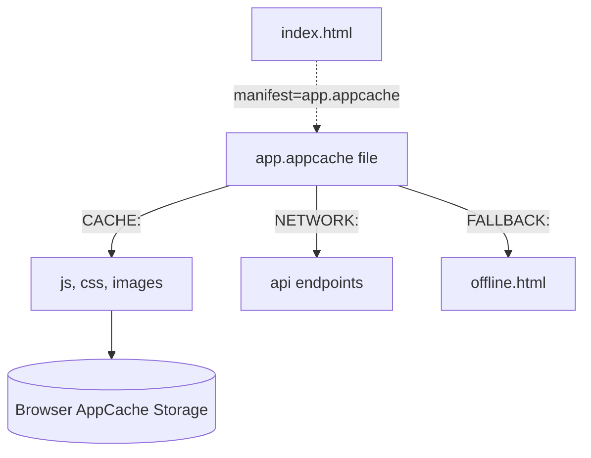

# Application Cache (AppCache)

**Application Cache (AppCache)** — это устаревшая и официально удаленная из современных браузеров технология, которая была первой попыткой HTML5 дать веб-приложениям возможность работать в офлайне.

Какую боль мы решаем? Исторически, веб не работал без интернета. AppCache позволил разработчикам создать манифест (файл с расширением `.appcache`), где перечислялись все файлы, которые браузер должен скачать и сохранить для офлайна. Звучит идеально, но на практике это стало сущим кошмаром.



## Как это работало (Антипаттерн)

Разработчик создавал манифест и подключал его в тег `<html>`:
```html
<html manifest="example.appcache">
```
И сам манифест:
```text
CACHE MANIFEST
# v1.0.0
CACHE:
/index.html
/style.css
/app.js

NETWORK:
/api/
```

## Почему технология умерла (Неочевидные нюансы)
* **Абсолютная негибкость:** Если вы закэшировали `index.html` (а браузер кэшировал его неявно, если он ссылался на манифест), обновить приложение становилось невероятно сложно. Браузер всегда отдавал старый `index.html` *до* того, как проверял манифест на сервере.
* **Сломанные обновления:** Даже если вы изменили `app.js`, браузер не скачивал его, пока вы не измените сам файл `example.appcache` (обычно меняли комментарий `# v1.0.1`).
* **Ловушка двойного обновления:** Когда браузер всё-таки обнаруживал новый манифест, он скачивал новые файлы в фоне. Но пользователь на экране *всё еще* видел старую версию! Нужно было перезагрузить страницу дважды или писать сложный JS-код с `applicationCache.swapCache()`.
* **Замена:** Вся эта неповоротливая магия была полностью вырезана из веба (начиная с Chrome 85). На смену пришли **Service Workers** и **Cache Storage API**, которые дают полный программный контроль вместо декларативного манифеста.
