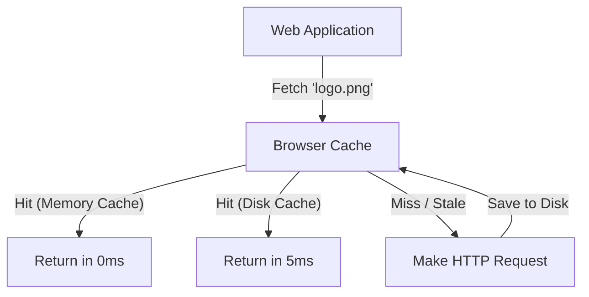

# Browser Cache (Кэш браузера / Memory Cache / Disk Cache)

**Browser Cache** — это встроенный, управляемый самим браузером механизм сохранения результатов HTTP-запросов на жестком диске (Disk Cache) или в оперативной памяти (Memory Cache) для повторного использования.

Какую боль мы решаем? Каждый ресурс (картинка, скрипт) требует времени на установку TCP-соединения, TLS-рукопожатие и саму передачу по сети. Браузерный кэш позволяет пропустить этот процесс и загрузить файлы практически мгновенно (от 0 до 10 мс), делая веб-серфинг комфортным.



## Как это работает на практике

Разработчик *не может* напрямую управлять этим кэшем через JavaScript (не путать с `localStorage` или `Cache Storage`). Управление происходит исключительно через HTTP-заголовки ответов сервера: `Cache-Control`, `ETag`, `Last-Modified`.

Браузер использует два уровня:
1. **Memory Cache:** Самый быстрый. Ресурсы, которые распарсены и лежат в оперативной памяти текущей вкладки. Исчезает при закрытии вкладки.
2. **Disk Cache:** Персистентный кэш на жестком диске. Выживает после перезагрузки ПК, но медленнее (требует чтения с диска).

```http
# Правильный подход для статики (JS/CSS с хэшами):
Cache-Control: public, max-age=31536000, immutable

# Правильный подход для HTML (всегда проверять на сервере):
Cache-Control: no-cache
```

## Неочевидные нюансы
* **no-cache vs no-store:** 
  - `no-cache`: "Вы можете кэшировать это, но **обязаны** каждый раз делать сетевой запрос к серверу (например, с `If-None-Match`), чтобы проверить, не изменился ли файл".
  - `no-store`: "Вообще никогда не сохраняйте это на диск и в память" (строго для банковских данных).
* **Heuristic Caching (Эвристическое кэширование):** Если ваш сервер забыл прислать заголовки `Cache-Control` или `Expires`, браузер не будет запрашивать файл каждый раз. Он включит магию (эвристику): посмотрит на заголовок `Last-Modified` и высчитает TTL по формуле `(Date - Last-Modified) / 10`. Из-за этого разработчики часто не могут понять, почему файл "залип" в кэше.
* **Disable Cache в DevTools:** Когда открыты инструменты разработчика и стоит галочка "Disable Cache", браузер кэш полностью игнорируется. Не забывайте снимать её при тестировании производительности!
