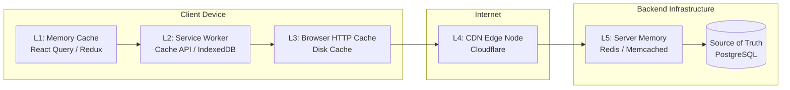

# Cache Hierarchy (Иерархия кэширования)

**Иерархия кэширования** — это концепция многоуровневого (эшелонированного) сохранения данных на пути от UI-компонента до базы данных на сервере. 

Какую боль мы решаем? Один уровень кэша не может удовлетворить все потребности. Быстрая оперативная память на клиенте ограничена мегабайтами (и теряется при обновлении). Диск клиента медленнее, но хранит гигабайты. CDN близок к клиенту географически, но общий для всех. Выстраивая иерархию (L1, L2, L3...), мы получаем баланс между скоростью, объемом и актуальностью.

## Как это работает на практике

Когда приложение запрашивает ресурс, оно проходит сквозь эти слои ("пробивая" их по очереди при Cache Miss):

1. **Memory (L1):** `const user = queryCache.get('user')`. Время ответа: `~0.1ms`. Выживает до F5.
2. **SW Cache (L2):** `caches.match(req)`. Время ответа: `~2-5ms`. Контролируется JS-кодом.
3. **HTTP Cache (L3):** Диск браузера. Время ответа: `~10-20ms`. Контролируется HTTP-заголовками.
4. **CDN (L4):** Сервер провайдера в вашем городе. Время ответа: `~30-50ms`. Общий для всех пользователей.
5. **Redis (L5):** In-memory кэш перед БД. Время ответа: `~100-200ms` (из-за сети).

## Неочевидные нюансы
* **Эффект матрешки (Shadowing):** Если вы закэшируете файл в Service Worker (L2) навсегда, то даже если вы очистите CDN (L4) и обновите сервер, пользователь этого *не увидит*. Нижние уровни (L1, L2) "экранируют" (shadow) верхние. Кэшировать агрессивно (навсегда) безопасно только самые дальние слои (CDN), или использовать Content-Hashing.
* **Двойное кэширование (Оверхед):** Если Service Worker просто клонирует ответ из сети без сложной логики, он часто дублирует работу встроенного HTTP-кэша браузера (L3). Это увеличивает потребление диска на устройстве в два раза.
* **Инвалидация:** Чем больше слоев в вашей иерархии, тем сложнее процесс инвалидации. Выкат новой версии может потребовать очистки CDN, рестарта Redis, и отправки Push-уведомления Service Worker'у на очистку его кэша.
