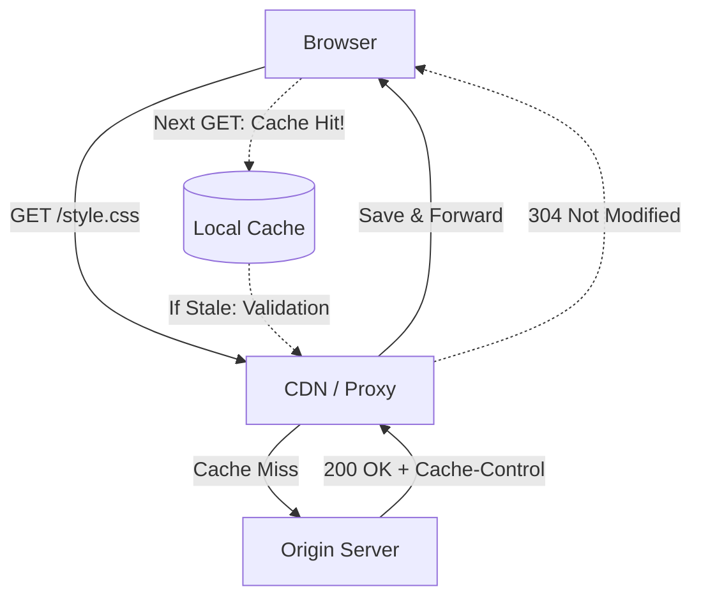

# HTTP Cache (HTTP-кэш)

**HTTP Cache** — это стандарт кэширования на уровне протокола HTTP, управляемый через заголовки запросов и ответов. Это фундамент производительности любого веб-ресурса.

Какую боль мы решаем? Передавать одни и те же байты (например, логотип сайта) при каждом обновлении страницы — это бессмысленная трата ресурсов сервера, пропускной способности сети и батареи пользователя. HTTP Cache позволяет серверу сказать браузеру: "Сохрани этот файл и не спрашивай меня о нем еще год" или "Спроси меня, изменился ли он, прежде чем скачивать снова".



## Как это работает на практике

Управление происходит через заголовок `Cache-Control`. Существует два основных механизма:

1. **Кэширование по времени (Expiration):**
   - Сервер шлет: `Cache-Control: max-age=3600` (Кэшировать на час).
   - Браузер даже не делает сетевой запрос в течение часа.
2. **Валидация (Validation):**
   - Сервер шлет: `Cache-Control: no-cache` + `ETag: "v1"`.
   - В следующий раз браузер шлет запрос с заголовком `If-None-Match: "v1"`.
   - Сервер проверяет: если файл не изменился, возвращает пустой ответ `304 Not Modified` (весит 0 байт). Браузер берет файл из кэша.

```http
# Правильный паттерн для изменяемого HTML:
Cache-Control: no-cache, must-revalidate
ETag: "33a64df551425fcc55e4d42a148795d9f25f89d4"

# Правильный паттерн для неизменяемой статики (шрифты, JS-чанки с хэшами):
Cache-Control: public, max-age=31536000, immutable
```

## Неочевидные нюансы
* **Vary (Разделение кэша):** Если ваш сервер возвращает сжатый (gzip) или несжатый ответ в зависимости от заголовка `Accept-Encoding`, вы *обязаны* вернуть заголовок `Vary: Accept-Encoding`. Иначе CDN может закэшировать сжатую версию и отдать ее старому браузеру, который не умеет её распаковывать, показав пользователю кракозябры.
* **Игнорирование `Cache-Control`:** Пользовательское нажатие `Ctrl+F5` (или Shift+Reload) заставляет браузер добавить в свой запрос `Cache-Control: no-cache`. Это пробивает HTTP-кэш насквозь вплоть до Origin-сервера, заставляя его отдать свежие данные.
* **`immutable` директива:** Добавление слова `immutable` говорит браузеру, что файл *никогда* не изменится. Это предотвращает лишние проверки `304 Not Modified` при перезагрузке страницы кнопкой F5.
