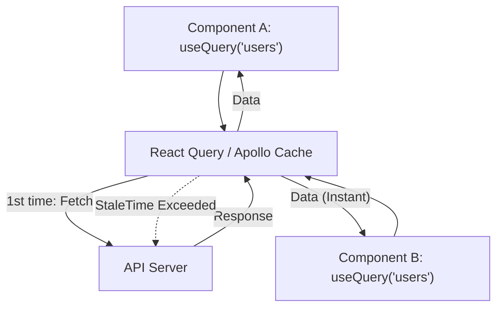

# Server State Cache (Кэширование состояния сервера на клиенте)

**Server State Cache** — это концепция хранения асинхронных данных, полученных с сервера, в специализированном локальном хранилище (кэше) фронтенд-приложения, с автоматическим управлением их свежестью, инвалидацией и фоновым обновлением.

Какую боль мы решаем? Долгое время разработчики хранили серверные данные (списки пользователей, профили) в глобальном сторе (Redux/Vuex) вместе с UI-стейтом (открыто ли модальное окно). Это приводило к огромному количеству бойлерплейта (actions: `FETCH_START`, `FETCH_SUCCESS`, `FETCH_ERROR`) и проблемам с рассинхронизацией (данные в Redux протухали, а мы не знали, когда их обновлять). Server State Cache отделяет "данные, которыми мы не владеем" в отдельный умный слой.



## Как это работает на практике

Главные представители этого паттерна: **React Query**, **SWR**, **Apollo Client** (для GraphQL), **RTK Query**. 

Библиотека берет на себя всю грязную работу: дедупликацию запросов (чтобы 5 компонентов не сделали 5 одинаковых HTTP-запросов), кэширование, ретраи при падении сети, фоновую ревалидацию и поллинг.

```javascript
// Правильный паттерн (Использование React Query)
function UserProfile({ userId }) {
  const { data, isLoading, isError } = useQuery({
    queryKey: ['user', userId], // Уникальный ключ кэша
    queryFn: () => fetchUser(userId),
    staleTime: 5 * 60 * 1000, // Считать свежими 5 минут
    gcTime: 30 * 60 * 1000    // Удалить из памяти через 30 минут неактивности
  });

  if (isLoading) return <Spinner />;
  if (isError) return <Error />;
  return <div>{data.name}</div>;
}
```

## Неочевидные нюансы
* **Не путать с UI-стейтом:** Состояние сервера (Server State) — это то, что хранится в БД (имя пользователя). UI-стейт (Client State) — это то, что живет только в браузере (тема оформления, сортировка таблицы). Их **нельзя** смешивать в одном инструменте. Для UI-стейта используйте Zustand/Redux/Context, для Server State — React Query.
* **Структурное совмещение (Structural Sharing):** Умные кэши при получении новых данных с сервера сравнивают их со старыми. Если объект логически не изменился (содержимое то же), кэш сохраняет ссылку (reference) на старый объект. Это предотвращает лишние ререндеры React-компонентов.
* **Hydration (Дегидратация):** При Server-Side Rendering (SSR) состояние кэша собирается на сервере, сериализуется в HTML (Dehydrate), отправляется в браузер и там "оживляется" (Hydrate). Если ключи или данные не совпадут, приложение сломается из-за Hydration Mismatch.
