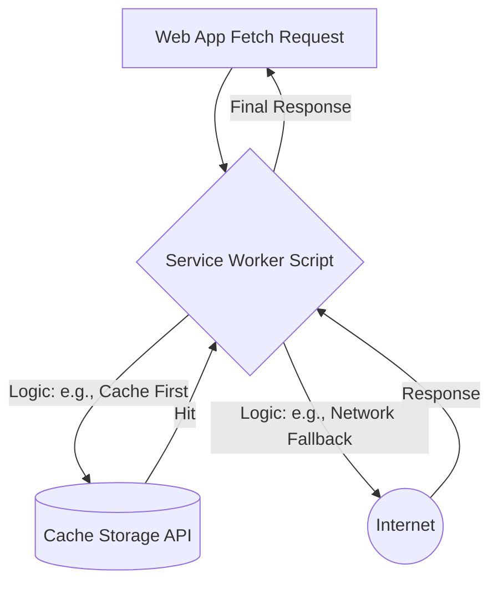

# Service Worker Cache (Кэш Сервис-воркера)

**Service Worker Cache** (реализован через Cache Storage API) — это программируемый слой кэширования, который находится между сетевым слоем браузера и интернетом. 

Какую боль мы решаем? Стандартный HTTP-кэш браузера — это черный ящик. Вы не можете через JavaScript сказать: "Удали вот эту картинку из кэша" или "Предзагрузи мне все файлы для офлайна и покажи прогресс-бар". Service Worker Cache дает полный программный контроль. Вы сами пишете код (стратегию), который решает, что брать из сети, а что отдавать из кэша.



## Как это работает на практике

Кэш Service Worker'а доступен через глобальный объект `caches`. Он работает асинхронно и персистентен (выживает после закрытия вкладки и перезагрузки устройства).

```javascript
// Правильный паттерн: Управление версиями кэша
const CACHE_NAME = 'app-cache-v2'; // При изменении версии старый кэш нужно удалить
const ASSETS_TO_CACHE = ['/', '/style.css', '/app.js'];

// Фаза установки (Precaching)
self.addEventListener('install', event => {
  event.waitUntil(
    caches.open(CACHE_NAME).then(cache => cache.addAll(ASSETS_TO_CACHE))
  );
});

// Фаза активации (Очистка старых кэшей)
self.addEventListener('activate', event => {
  event.waitUntil(
    caches.keys().then(keys => Promise.all(
      keys.filter(key => key !== CACHE_NAME).map(key => caches.delete(key))
    ))
  );
});
```

## Неочевидные нюансы
* **Bypass HTTP Cache:** Если Service Worker запрашивает ресурс из сети для добавления в `caches` (например, через `cache.addAll`), этот запрос может быть перехвачен *встроенным HTTP-кэшем браузера*. В итоге Service Worker закэширует протухший файл! Чтобы этого избежать, современные инструменты (Workbox) добавляют параметры `?__WB_REVISION=123` к URL при запросах из воркера.
* **Утечки памяти (Квоты):** Кэш Service Worker'а не очищается сам по себе (в отличие от HTTP-кэша). Если вы реализуете стратегию *Network First* с сохранением ответов, но не напишете логику вытеснения (например, хранить только 50 последних картинок), кэш разрастется до гигабайтов, и браузер (особенно Safari на iOS) может принудительно удалить **все** данные вашего сайта без предупреждения (Origin Eviction).
* **Workbox:** Никто в здравом уме не пишет сложную логику Service Worker Cache с нуля в продакшене. Абсолютный стандарт индустрии — использование библиотеки **Workbox** от Google, которая предоставляет готовые стратегии (SWR, CacheFirst) и инструменты для Precaching.
