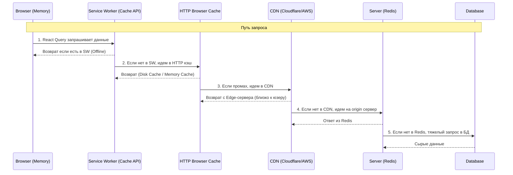

# Уровни кэширования (Caching Layers)

Современное веб-приложение — это многослойный пирог. Запрос от браузера до базы данных проходит через множество посредников, и каждый из них может закэшировать ответ. Понимание этих слоев критично, чтобы не искать баг на фронтенде, когда данные закэшировал CDN.

## Какую боль мы решаем?
Мы решаем проблему задержки (latency) и нагрузки на сервер. Вместо того чтобы гонять запросы через океан к базе данных, мы стараемся отдать данные как можно ближе к пользователю.

## Слои архитектуры

### 1. In-Memory Cache (Браузерная память)
* **Инструменты:** React Query, Apollo Client, Zustand.
* **Суть:** Самый быстрый кэш. Живет, пока открыта вкладка.
* **Плюс:** Мгновенный отклик, данные уже в виде готовых JavaScript объектов.

### 2. Service Worker (Cache API / IndexedDB)
* **Инструменты:** Workbox, Dexie.js.
* **Суть:** Перехватчик запросов в браузере. Позволяет приложению работать без интернета.
* **Плюс:** Сохраняется между сессиями.

### 3. HTTP Browser Cache (Дисковый кэш)
* **Суть:** Стандартный механизм браузера, управляемый заголовками (например, `Cache-Control: max-age=31536000`).
* **Антипаттерн:** Кэширование `index.html`. Если закэшировать главный HTML, пользователь никогда не получит ссылки на новые JS-бандлы! `index.html` всегда должен быть `Cache-Control: no-cache`.

### 4. Edge / CDN
* **Суть:** Кэш на серверах провайдера (Cloudflare), расположенных физически близко к пользователю (в его городе или стране).
* **Применимость:** Статика, медиа, публичные API (например, список товаров, одинаковый для всех).

### 5. Backend Cache (Redis / Memcached)
* **Суть:** Кэширование сложных SQL-запросов на стороне сервера.

## Трейдоффы и границы применимости
* **Проблема "двойного кэширования":** Если у вас настроен жесткий кэш в Service Worker и агрессивный HTTP-кэш, при обновлении Service Worker браузер может скачать из HTTP-кэша старую версию ресурсов для нового воркера.
* **Персонализация:** Никогда не кэшируйте ответы, зависящие от пользователя (например, корзину или профиль) на уровне CDN, если только вы не используете сложные заголовки `Vary` (Vary: Cookie). Иначе пользователь А увидит приватные данные пользователя Б.
