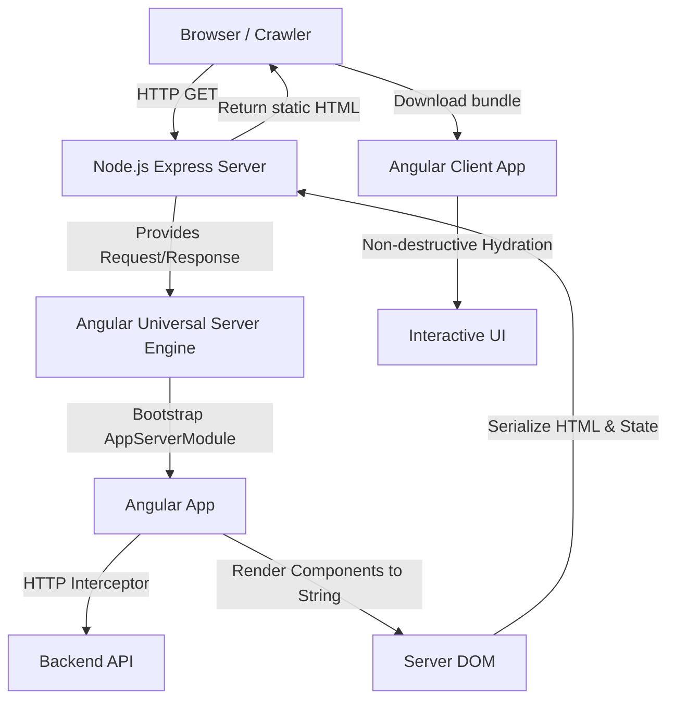

# Angular Universal (SSR / Prerendering)

## Что это и какую боль решаем
Angular по умолчанию — это тяжелый Single Page Application (SPA) фреймворк. Первая загрузка (First Contentful Paint) занимает много времени из-за огромного JS-бандла, а поисковые роботы видят пустой `<app-root>`. Angular Universal (теперь интегрирован в Angular CLI напрямую) решает эту проблему за счет Server-Side Rendering (SSR) и статического пререндеринга.

## Как это работает
Вместо браузерного DOM-дерева, Angular на сервере использует платформу `platform-server` и библиотеку Domino (в старых версиях) для рендеринга компонентов в строку HTML. На клиенте приложение загружается, перехватывает этот HTML и происходит процесс гидратации.
С версии Angular 16+ появилась **Non-destructive Hydration**: фреймворк больше не уничтожает серверный DOM перед клиентским рендерингом, а переиспользует его, что значительно ускоряет загрузку и предотвращает "моргание" экрана.



## Пример кода: Передача стейта с сервера на клиент (TransferState)

Чтобы клиент не делал повторный HTTP-запрос при гидратации, используется `TransferState`.

```typescript
import { Component, OnInit, PLATFORM_ID, Inject, makeStateKey, TransferState } from '@angular/core';
import { isPlatformServer } from '@angular/common';
import { HttpClient } from '@angular/common/http';

const DATA_KEY = makeStateKey<string>('my_data');

@Component({
  selector: 'app-data',
  template: `<div>{{ data }}</div>`
})
export class DataComponent implements OnInit {
  data: string = '';

  constructor(
    private http: HttpClient,
    @Inject(PLATFORM_ID) private platformId: Object,
    private transferState: TransferState
  ) {}

  ngOnInit() {
    if (this.transferState.hasKey(DATA_KEY)) {
      // Клиент: читаем стейт, оставленный сервером
      this.data = this.transferState.get(DATA_KEY, '');
      this.transferState.remove(DATA_KEY);
    } else {
      // Сервер (или клиент при навигации): делаем запрос
      this.http.get<string>('/api/data').subscribe(res => {
        this.data = res;
        if (isPlatformServer(this.platformId)) {
          // Сервер: сохраняем стейт в HTML
          this.transferState.set(DATA_KEY, this.data);
        }
      });
    }
  }
}
```

## Неочевидные нюансы и трейдоффы
- **Доступ к DOM:** Прямое обращение к `window`, `document` или `navigator` вызовет ошибку на сервере (ReferenceError). Нужно использовать Angular-абстракции (`Renderer2`, `DOCUMENT` injection token) или проверять `isPlatformBrowser(platformId)`.
- **Проблема с setTimeout и Zone.js:** Angular использует Zone.js для отслеживания асинхронных операций. Если на сервере запустить долгий `setInterval` или бесконечный RxJS стрим, процесс рендеринга страницы никогда не завершится, и клиент отвалится по таймауту (Server timeout).
- **Absolute URLs:** На сервере HTTP-запросы должны использовать абсолютные URL (например, `http://localhost:8080/api`), так как относительные пути (типа `/api`) не работают вне браузера (у сервера нет понятия "текущий хост" по умолчанию).
- **Утечки памяти (Memory Leaks):** Как и в любом Node.js SSR, глобальные переменные и статические свойства классов сохраняют свое состояние между запросами разных пользователей.
