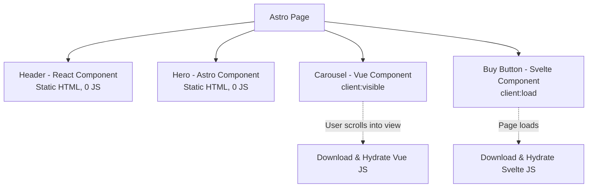

# Astro Architecture: Островная архитектура и Zero-JS по умолчанию

## Что это и какую боль решает
Astro — это современный веб-фреймворк, сфокусированный на контентных сайтах. Главная боль современных SPA/SSR-фреймворков — огромный объем JavaScript, отправляемый на клиент для "гидратации" страницы, даже если интерактивен только один маленький виджет. Astro решает эту проблему, отправляя **0 КБ JS по умолчанию** и используя "Островную архитектуру" (Islands Architecture).

## Как работает
Astro рендерит HTML на сервере на этапе сборки (SSG) или по запросу (SSR). Все UI-компоненты (которые можно писать на Astro, React, Vue, Svelte, Solid) превращаются в чистый статический HTML. Если компоненту нужен JS на клиенте для интерактивности, вы явно указываете директиву гидратации (`client:load`, `client:visible`, `client:idle`).



## Примеры кода

**Паттерн: Partial Hydration (Использование Островов)**
`index.astro`:
```astro
---
// Фронтматер: этот код выполняется ТОЛЬКО при билде или на сервере (SSR).
// В бандл браузера он не попадет.
import Header from '../components/Header.jsx';
import InteractiveCart from '../components/Cart.svelte';
import HeavyChart from '../components/Chart.vue';

const response = await fetch('https://api.example.com/items');
const data = await response.json();
---

<html lang="en">
  <body>
    <!-- Статика, React JS не грузится в браузер -->
    <Header items={data} /> 
    
    <!-- Интерактивный компонент, Svelte JS загрузится сразу при открытии -->
    <InteractiveCart client:load />
    
    <!-- Тяжелый график, Vue JS загрузится только когда юзер доскроллит до него -->
    <HeavyChart client:visible data={data} />
  </body>
</html>
```

## Где применимо
- Блоги, маркетинговые и лендинг страницы.
- E-commerce витрины (каталог товаров до чекаута).
- Документация (как Starlight).
- Везде, где критически важен SEO, TTI (Time to Interactive) и LCP (Largest Contentful Paint).

## Неочевидные нюансы и трейдоффы
- **Меж-островная коммуникация:** Острова полностью независимы друг от друга. Чтобы передать состояние между React-островом в шапке (корзина) и Vue-островом в контенте (кнопка купить), нужен внешний независимый стейт-менеджер. Astro рекомендует использовать **Nano Stores** для шаринга стейта вне рантаймов фреймворков.
- **Оверхед на полиглотию:** Astro позволяет миксовать фреймворки, но если вы используете React-карусель и Vue-график на одной странице, пользователю в фоне загрузятся два разных рантайма фреймворков. Лучшая практика — выбрать один UI-фреймворк для всех интерактивных островов в проекте.
- **SPA-переходы:** По умолчанию Astro генерирует MPA (Multi-Page Application), при клике на ссылку происходит полная "жесткая" перезагрузка страницы браузером. Astro добавил поддержку View Transitions API для бесшовных анимаций между страницами, но держать сложный глобальный стейт (как непрерывно играющий плеер в Spotify) при MPA-навигации всё равно сложнее, чем в классическом SPA.
