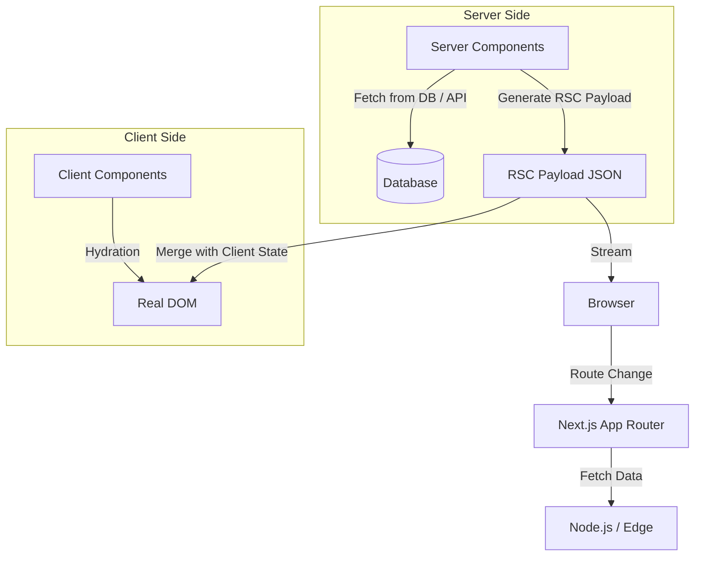

# Next.js Architecture

## Что это и какую боль решаем
Next.js — это метафреймворк поверх React, решающий проблемы роутинга, рендеринга (SSR, SSG, ISR) и оптимизации (картинки, шрифты). Главная боль классического React (SPA) — медленная загрузка, пустой HTML для поисковиков и огромные бандлы. Next.js App Router (с 13 версии) радикально меняет архитектуру за счет **React Server Components (RSC)**.

## Как это работает
В архитектуре App Router компоненты по умолчанию являются серверными. Они рендерятся один раз на сервере и никогда не отправляют свой JavaScript на клиент. Клиентские компоненты (`"use client"`) используются только там, где нужна интерактивность (state, эффекты, обработчики событий).



## Пример кода: Серверные и Клиентские компоненты

```tsx
// app/page.tsx (Server Component по умолчанию)
// Запускается только на сервере, бандл на клиент не идет
import db from '@/lib/db';
import InteractiveButton from './InteractiveButton';

export default async function Page() {
  const users = await db.query('SELECT * FROM users'); // Прямой запрос в БД!
  
  return (
    <div>
      <h1>Users</h1>
      <ul>{users.map(u => <li key={u.id}>{u.name}</li>)}</ul>
      {/* Клиентский компонент внутри серверного */}
      <InteractiveButton />
    </div>
  );
}

// app/InteractiveButton.tsx (Client Component)
'use client';
import { useState } from 'react';

export default function InteractiveButton() {
  const [count, setCount] = useState(0);
  return <button onClick={() => setCount(count + 1)}>Clicks: {count}</button>;
}
```

## Неочевидные нюансы и трейдоффы
- **Граница "use client":** Пропсы, передаваемые от серверного компонента к клиентскому, должны быть сериализуемыми (нельзя передать функцию или класс).
- **Агрессивное кэширование:** Next.js кэширует почти всё по умолчанию (`fetch`, роуты, сегменты). Это приводит к неочевидным багам "почему данные не обновились". Приходится явно инвалидировать кэш (`revalidatePath`, `revalidateTag`).
- **Сложность ментальной модели:** Разработчик должен постоянно думать, где выполняется код — на сервере (Node API, секреты) или на клиенте (Browser API, хуки).
- **Увеличение нагрузки на сервер:** В отличие от SPA, где сервер отдает только статику, в Next.js сервер активно вовлечен в рендеринг и маршрутизацию каждого перехода.
