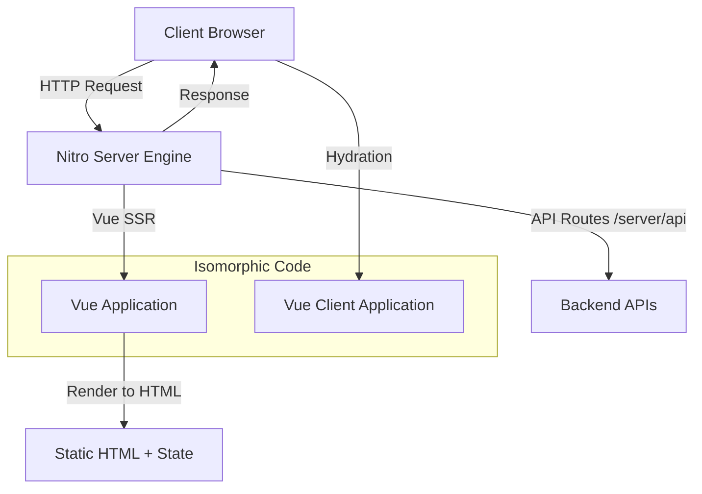

# Nuxt Architecture

## Что это и какую боль решаем
Nuxt — это мощный метафреймворк для Vue.js. Он решает те же задачи, что и Next.js для React: SEO, файловый роутинг, Server-Side Rendering (SSR) и генерация статических сайтов (SSG). В Nuxt 3 была представлена архитектура на базе движка **Nitro**, который абстрагирует серверную часть, позволяя деплоить приложение куда угодно: от Node.js до Edge Workers (Cloudflare, Vercel).

## Как это работает
Nuxt разделяет приложение на две среды: серверную (Nitro) и клиентскую (Vue). Универсальный (Isomorphic) код рендерится на сервере, отправляется в виде HTML, а затем гидрируется на клиенте.
Nitro — это серверный движок, который умеет отдавать API, кэшировать запросы и рендерить страницы, будучи при этом невероятно легковесным (основан на h3).



## Пример кода: Data Fetching (Универсальный)

```vue
<!-- pages/users.vue -->
<script setup>
// useAsyncData гарантирует, что запрос выполнится на сервере во время SSR,
// стейт сериализуется и передастся клиенту. 
// На клиенте запрос не будет дублироваться при гидратации.
const { data: users, pending, error } = await useAsyncData('users', () => {
  return $fetch('/api/users') // $fetch работает и на сервере, и на клиенте
})
</script>

<template>
  <div v-if="pending">Loading...</div>
  <div v-else-if="error">Error loading users</div>
  <ul v-else>
    <li v-for="user in users" :key="user.id">{{ user.name }}</li>
  </ul>
</template>
```

## Неочевидные нюансы и трейдоффы
- **Утечки памяти на сервере (Cross-Request State Pollution):** Использование глобальных переменных в Nuxt может привести к тому, что данные одного пользователя будут отданы другому, так как Node.js процесс шарится между запросами. Нужно всегда использовать `useState` или предоставляемые контексты фреймворка.
- **Ограничения Composition API в SSR:** Нельзя использовать браузерные API (window, document) прямо в `setup()`, если они не обернуты в `onMounted`, так как `setup()` выполняется на сервере.
- **Nitro Edge:** Деплой на Edge Workers (например, Cloudflare) накладывает жесткие ограничения на размер бандла и доступные Node.js API (нет полноценного `fs` или `path`).
- **Автоимпорты (Auto-imports):** Nuxt делает магию, автоматически импортируя компоненты и хуки. Это ускоряет разработку, но может усложнить понимание зависимостей и поддержку IDE, если не настроен TS-плагин.
