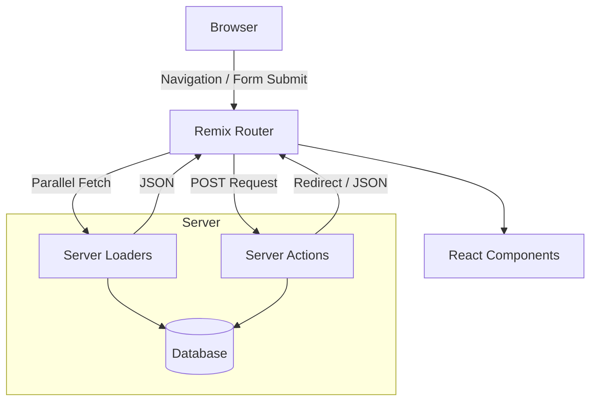

# Remix Architecture

## Что это и какую боль решаем
Remix — это фуллстек-фреймворк для React, который фокусируется на веб-стандартах (Fetch API, HTML формы) и решает проблему сложных SPA: водопады запросов (request waterfalls), обработка форм и управление состоянием загрузки. Remix отказывается от парадигмы статической генерации (SSG) в пользу быстрого SSR (Server-Side Rendering) на Edge-серверах и параллельной загрузки данных.

## Как это работает
Remix использует концепцию вложенных роутов (Nested Routing). Для каждого роута на сервере может быть определен `loader` (для чтения данных) и `action` (для мутации данных). При переходе на новую страницу Remix параллельно вызывает все `loader` для иерархии роутов. Формы работают через стандартный `<form>`, а мутации автоматически инвалидируют данные во всех активных `loader`.



## Пример кода: Loader, Action и Component

```tsx
// app/routes/projects/$projectId.tsx
import { json, redirect } from "@remix-run/node";
import { useLoaderData, Form } from "@remix-run/react";

// Выполняется ТОЛЬКО на сервере. Чтение данных.
export const loader = async ({ params }) => {
  const project = await db.getProject(params.projectId);
  return json({ project }); // Возвращаем данные для компонента
};

// Выполняется ТОЛЬКО на сервере. Обработка мутаций (POST, PUT, DELETE).
export const action = async ({ request, params }) => {
  const formData = await request.formData();
  await db.updateProject(params.projectId, formData.get("title"));
  return redirect(`/projects/${params.projectId}`); // Автоматически обновит loaders!
};

// Рендерится на сервере, затем гидрируется на клиенте.
export default function Project() {
  const { project } = useLoaderData<typeof loader>();
  
  return (
    <div>
      <h1>{project.title}</h1>
      {/* Remix Form перехватывает сабмит и делает fetch-запрос */}
      <Form method="post">
        <input type="text" name="title" defaultValue={project.title} />
        <button type="submit">Update</button>
      </Form>
    </div>
  );
}
```

## Неочевидные нюансы и трейдоффы
- **Отсутствие Client-Side State для данных:** Remix призывает отказаться от Redux/Zustand для данных с сервера. Сервер является единственным источником истины. Мутация (action) автоматически обновляет UI.
- **Отказ от SSG:** В отличие от Next.js, Remix не поддерживает статическую генерацию во время билда. Предполагается использование мощных CDN с `Cache-Control` заголовками (Distributed Web) и быстрых баз данных.
- **Обработка ошибок:** В Remix есть концепция `ErrorBoundary` и `CatchBoundary` (в v2 объединено в `ErrorBoundary`), которая позволяет изолировать ошибку в конкретном вложенном роуте, не ломая все приложение.
- **Бандлинг зависимостей:** Серверный код (loaders/actions) должен быть тщательно изолирован от клиентского, чтобы секреты и серверные библиотеки (например, `fs` или `bcrypt`) не попали в клиентский бандл.
