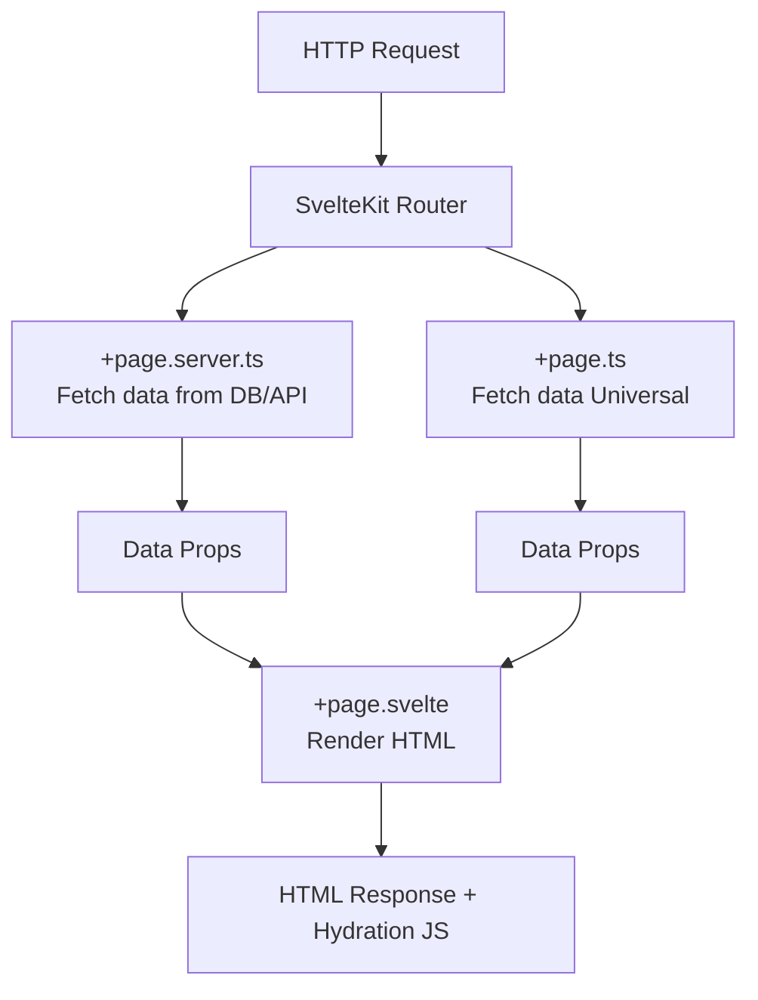

# SvelteKit Architecture: Компиляция и роутинг без боли

## Что это и какую боль решает
SvelteKit — это мета-фреймворк поверх Svelte. Если React/Vue тянут рантайм для виртуального DOM на клиент, Svelte **компилирует** компоненты в императивный ванильный JS на этапе сборки. SvelteKit добавляет к этому серверный рендеринг, файловый роутинг, управление данными и API-эндпоинты, решая проблему "сборки Франкенштейна" из роутеров и бандлеров.

## Как работает
Роутинг основан на директориях. В каждой директории (роуте) могут лежать спец. файлы:
- `+page.svelte` (UI страницы)
- `+page.ts` (Универсальная загрузка данных: сервер + клиент)
- `+page.server.ts` (Только серверная загрузка: секреты, прямой доступ к БД)
- `+server.ts` (API эндпоинт / Webhooks)



## Примеры кода

**Паттерн: Серверная загрузка данных и Actions (мутации)**
`+page.server.ts`:
```typescript
import { db } from '$lib/database';
import type { PageServerLoad, Actions } from './$types';

export const load: PageServerLoad = async () => {
    // Выполняется ТОЛЬКО на сервере, безопасно дергать БД и использовать секреты
    return { posts: await db.getPosts() };
};

export const actions = {
    default: async ({ request }) => {
        const data = await request.formData();
        await db.createPost(data.get('title'));
    }
} satisfies Actions;
```

`+page.svelte`:
```svelte
<script lang="ts">
    import type { PageData } from './$types';
    export let data: PageData; // Типизировано из load!
</script>

<form method="POST">
    <input name="title" placeholder="Post title" />
    <button>Save</button>
</form>

<ul>
    {#each data.posts as post}
        <li>{post.title}</li>
    {/each}
</ul>
```

## Где применимо
- Интерактивные приложения с высокими требованиями к performance (минимальный JS бандл).
- Full-stack приложения малого и среднего размера, где важна типизация end-to-end без сложного GraphQL/tRPC сетапа.
- Панели управления, SaaS-продукты с высокой динамикой.

## Неочевидные нюансы и трейдоффы
- **Отсутствие виртуального DOM:** Компилятор генерирует точечные обновления DOM. Это работает супер-быстро, но при ОЧЕНЬ большом количестве и разнообразии компонентов на странице объем сгенерированного императивного JS-кода может превысить размер компактного рантайма (вроде React).
- **Специфика сторов (Stores):** Svelte Stores (`writable`, `derived`) объявляются как глобальные переменные. В SSR-контексте нужно быть предельно осторожным, чтобы не зашарить store между одновременными запросами разных пользователей (Memory Leak / Data Leak). Состояние нужно инстанцировать внутри `load` и прокидывать через context.
- **Адаптеры (Adapters):** SvelteKit требует явного `adapter` (Node, Vercel, Cloudflare, Static) для деплоя. Это круто абстрагирует инфраструктуру, но иногда затрудняет нестандартные серверные конфигурации (например, запуск кастомного долгоживущего WebSockets сервера в том же процессе).
