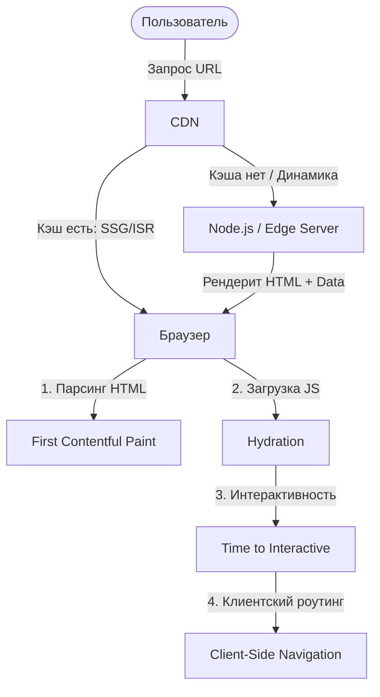

# Роутинг, Rendering и Доставка UI

Современный фронтенд давно перестал быть просто набором HTML-страниц и jQuery-скриптов. По мере усложнения бизнес-логики и роста требований к производительности, то, *как* мы генерируем интерфейс (рендеринг), *как* мы доставляем его до пользователя (доставка) и *как* мы перемещаемся между его частями (роутинг), стало фундаментом архитектуры любого веб-приложения.

## Суть проблемы: Борьба за время и ресурсы

Каждый раз, когда пользователь вводит URL в браузере, запускается сложный танец между сервером, CDN и клиентом. Мы должны решить:
1. **Где** генерируется HTML: на сервере при запросе (SSR), заранее во время сборки (SSG) или прямо в браузере (CSR)?
2. **Как** пользователь перемещается: перегружая страницу или подменяя компоненты через History API (Client-side Routing)?
3. **Когда** загружается JavaScript: сразу монолитом или лениво, разбитым на чанки по роутам?

Неправильный выбор стратегии ведет к долгому Time to Interactive (TTI), плохому SEO (поисковики видят пустой `div`), либо непомерным счетам за сервера (потому что мы рендерим на лету то, что можно было закэшировать).

## Наглядная архитектура доставки UI



## Где это применяется и где ломается

Разные продукты требуют разных стратегий. Не существует серебряной пули.

**Антипаттерн: Одинокий SPA для всего подряд**
Допустим, вы делаете контентный блог на чистом React (Create React App).
```javascript
// Плохо для блога: 
// Робот видит пустой <body><div id="root"></div></body>
// Пользователь ждет загрузки 2MB бандла, чтобы прочитать текст.
import { BrowserRouter, Route } from 'react-router-dom';

function App() {
  return (
    <BrowserRouter>
      <Route path="/article/:id" component={Article} />
    </BrowserRouter>
  );
}
```

**Правильное решение: Гибридный подход**
Для блога мы используем SSG (Static Site Generation), а для дашборда пользователя — CSR (Client-Side Rendering) или SSR. Современные мета-фреймворки (Next.js, Nuxt, SvelteKit) позволяют смешивать это на уровне роутов.
```javascript
// Next.js: Статическая генерация для контента
export async function getStaticProps() {
  const posts = await getPosts();
  return { props: { posts }, revalidate: 60 }; // ISR: перегенерация раз в 60 сек
}

export default function Blog({ posts }) {
  return <div>{posts.map(p => <Post key={p.id} data={p} />)}</div>;
}
```

## Неочевидные нюансы и трейдоффы

1. **Hydration Overhead**: Даже если вы отрендерили HTML на сервере (SSR), браузеру все равно нужно скачать JavaScript и "оживить" страницу (гидратация). На слабых мобильных устройствах это может занять секунды, создавая эффект "Uncanny Valley" (кнопка видна, но не нажимается). Решение: *Islands Architecture* (Astro) или *Resumability* (Qwik).
2. **Инвалидация кэша**: Самая сложная проблема в Computer Science. Если вы используете SSG, как быстро обновить цену товара? Появление *Incremental Static Regeneration (ISR)* и *Stale-while-revalidate* частично решает эту боль, но требует умного слоя CDN.
3. **Границы применимости Edge**: Рендеринг на Edge-воркерах (Cloudflare, Vercel Edge) звучит круто (близко к пользователю), но если ваша база данных все еще лежит в одном дата-центре в `us-east-1`, Edge-функция просто добавит задержку на сетевой прыжок от Edge до БД.
