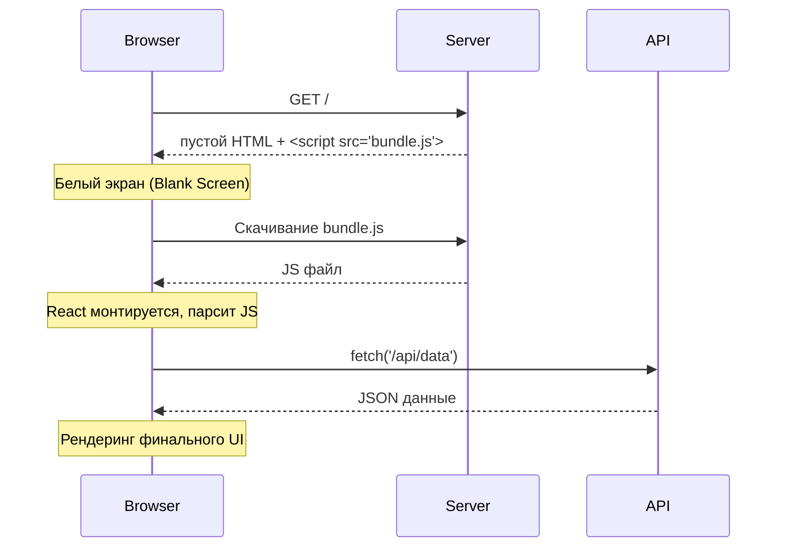

# CSR (Client-Side Rendering)

## Инженерная история
Традиционные сайты генерировали HTML на сервере при каждом клике. С появлением SPA (Single Page Applications) появилась модель CSR. Сервер отдает "пустой" HTML с тегом `<div id="root"></div>` и огромный JS-бандл. Вся логика, роутинг и рендеринг UI происходят в браузере. Боль: мы перенесли нагрузку с наших серверов на устройства пользователей.

## Визуализация


## Пример кода
Типичный входной файл `main.tsx` (Vite / CRA):
```tsx
import React from 'react'
import ReactDOM from 'react-dom/client'
import App from './App'

// В HTML лежит пустой <div id="root"></div>
const rootElement = document.getElementById('root')!

// Вся генерация DOM узлов происходит здесь, на клиенте
ReactDOM.createRoot(rootElement).render(
  <React.StrictMode>
    <App />
  </React.StrictMode>
)
```

## Неочевидные нюансы
- **Плюсы:** 
  - Разгрузка сервера (дешевый хостинг статики через CDN).
  - Очень быстрые переходы между страницами после первоначальной загрузки (без перезагрузки окна).
- **Минусы (Overhead & Трейдоффы):**
  - **Огромный TTI (Time to Interactive):** Пользователь видит белый экран, пока качается и парсится JS-бандл. На слабых мобильных устройствах парсинг 2MB JS может занять секунды.
  - **SEO (Search Engine Optimization):** Хотя Googlebot научился выполнять JS, другие поисковики, парсеры соцсетей (OpenGraph) и мессенджеров (Telegram, Slack) увидят только пустой `div`.
  - **Waterfall запросов:** Браузер не начнет скачивать данные (API fetch), пока не скачает JS, не распарсит его и не дойдет до хука `useEffect` компонента.
- **Границы применимости:** Идеально для B2B админок, SaaS-платформ за логином, сложных интерактивных веб-приложений (Figma, Notion), где SEO неважно, а сессия пользователя долгая.
