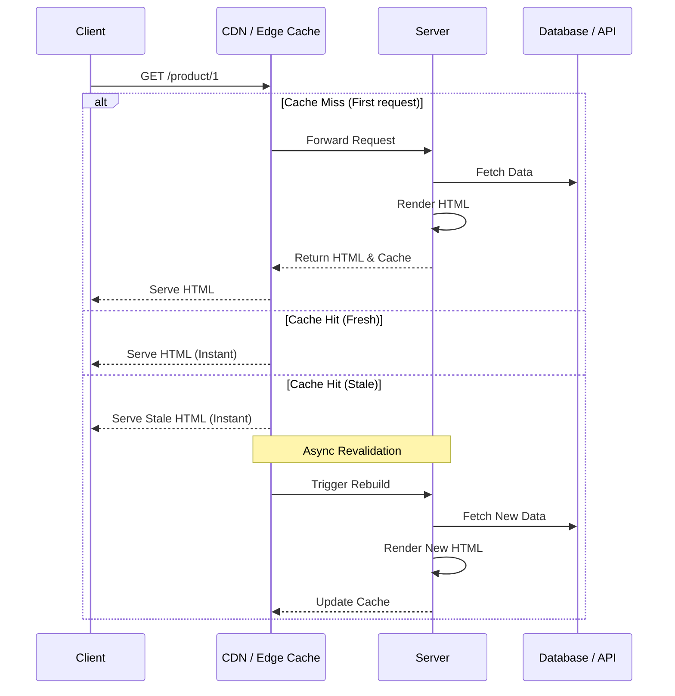

# Incremental Static Regeneration (ISR)

## Инженерная история
**Что это:** Гибридная стратегия, позволяющая обновлять статические страницы в фоновом режиме без полной пересборки сайта (SSG). 
**Какую боль решаем:** SSG ломается на больших объемах данных. Если у вас миллион товаров в магазине, полная пересборка занимает часы. ISR позволяет собрать только критические страницы заранее, а остальные — по запросу, и затем кэшировать их, периодически обновляя.
**Где применимо:** E-commerce (карточки товаров), новостные порталы, крупные блоги — там, где контента много, он меняется, но не требует мгновенной консистентности для каждого пользователя.
**Где ломается:** Когда требуется строгая консистентность (например, биллинг, корзина, где нельзя показать устаревшие на 10 секунд данные).

## Архитектура работы (Stale-While-Revalidate)



## Пример кода (Next.js)

```javascript
// Паттерн: Настройка времени ревалидации
export async function getStaticProps({ params }) {
  const res = await fetch(`https://api.example.com/products/${params.id}`);
  const product = await res.json();

  if (!product) {
    return { notFound: true };
  }

  return {
    props: { product },
    // Магия ISR: пересобирать страницу не чаще чем раз в 60 секунд
    revalidate: 60, 
  };
}

export async function getStaticPaths() {
  return {
    paths: [], // Не собираем ничего заранее
    fallback: 'blocking' // Первый пользователь будет ждать SSR, остальные получат кэш
  };
}
```

## Неочевидные нюансы

1. **Жертва первого посетителя:** При использовании паттерна *stale-while-revalidate*, пользователь, который запрашивает страницу после истечения времени жизни кэша, **получит старую версию**. Обновленная версия сгенерируется в фоне и достанется только *следующему* посетителю.
2. **On-Demand Revalidation:** Современные фреймворки (Next.js) позволяют сбрасывать кэш по Webhook (например, из CMS), решая проблему ожидания таймера `revalidate`. Это предпочтительнее слепого поллинга по таймеру.
3. **Проблемы с распределенным кэшем:** Если ваш CDN имеет множество узлов (Edge locations), кэш может инвалидироваться неравномерно. Пользователь из Европы может видеть новые данные, а из США — старые, пока локальный кэш не протухнет.
4. **Файловая система vs KV Store:** Под капотом ISR часто пишет сгенерированный HTML в файловую систему или в KV-хранилище (в случае serverless). При деплое на кластер контейнеров без общего диска (например, K8s) встроенный ISR Next.js "из коробки" будет работать криво — нужен централизованный кэш (например, Redis).
