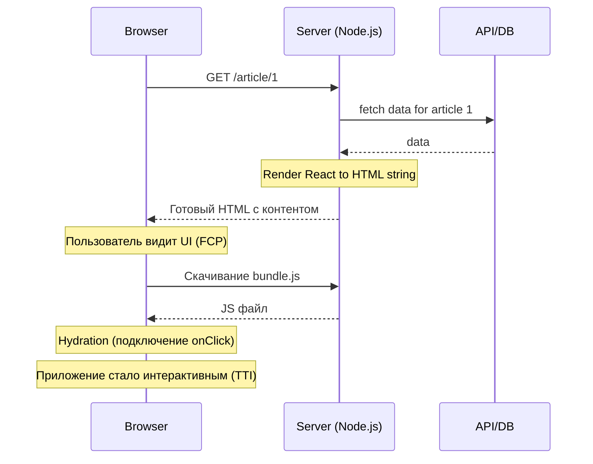

# SSR (Server-Side Rendering)

## Инженерная история
Чтобы решить проблемы CSR (белый экран и плохое SEO), придумали SSR. При каждом запросе сервер запускает React (или другой фреймворк), запрашивает нужные данные, генерирует готовый HTML и отправляет его в браузер. Пользователь мгновенно видит контент (Fast FCP). Затем браузер скачивает JS и "привязывает" обработчики событий к этому HTML — этот процесс называется **Гидратацией** (Hydration).

## Визуализация


## Пример кода
**Концепт SSR гидратации на клиенте (`hydrateRoot`):**
```tsx
import React from 'react'
import ReactDOM from 'react-dom/client'
import App from './App'

// Вместо createRoot используем hydrateRoot.
// React ожидает, что DOM уже содержит HTML, сгенерированный сервером.
ReactDOM.hydrateRoot(
  document.getElementById('root')!,
  <App />
)
```

**Next.js (Pages Router Server-Side):**
```tsx
export async function getServerSideProps(context) {
  // Выполняется только на Node.js сервере
  const res = await fetch(`https://api.example.com/data/${context.params.id}`);
  const data = await res.json();

  return { props: { data } }; // Передается в React компонент для рендера
}
```

## Неочевидные нюансы
- **Hydration Mismatch:** Если HTML с сервера и HTML, который пытается отрендерить клиент на основе начального стейта, не совпадают (например, сервер отрендерил время UTC, а клиент локальное), React выбросит ошибку Hydration Mismatch и часто полностью перерисует дерево, убив все плюсы SSR.
- **Uncanny Valley (Зловещая долина):** Есть окно времени между отрисовкой HTML и завершением гидратации. В этот момент пользователь видит кнопку, кликает на нее, но ничего не происходит (JS еще не загрузился и не привязал обработчик событий).
- **Оверхед на сервере:** Рендеринг React в строку на Node.js — ресурсоемкая синхронная операция. Под высокой нагрузкой (DDoS или скачок трафика) сервер может лечь, если не использовать мощное кэширование на уровне CDN.
- **Границы применимости:** E-commerce, блоги, новостные сайты, лендинги — везде, где важны SEO, мета-теги для соцсетей и быстрая первая отрисовка.
