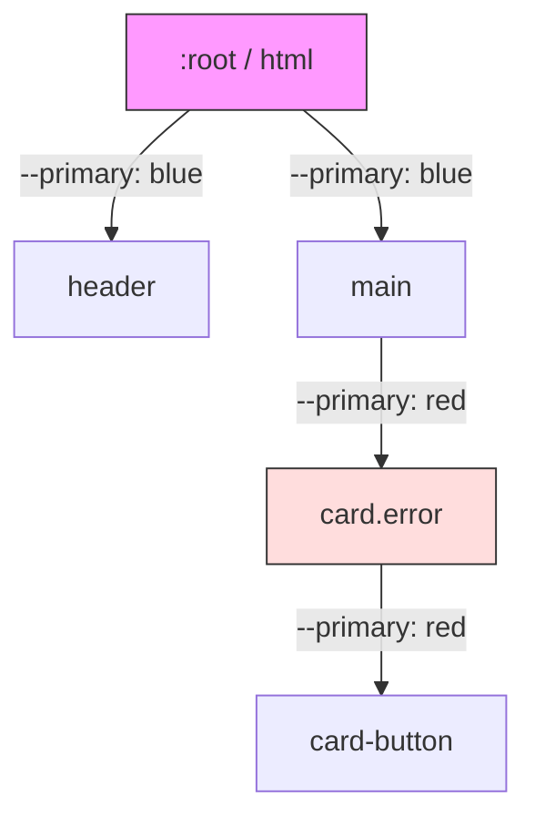

# CSS Custom Properties (CSS-переменные)

## Суть концепции
CSS Custom Properties (или CSS-переменные) — это сущности, определяемые автором CSS, содержащие специфические значения, которые можно повторно использовать в документе. В отличие от переменных в препроцессорах (Sass, Less), которые компилируются в статические значения, CSS-переменные "живут" в браузере, наследуются по DOM-дереву и могут быть изменены в рантайме.

## Какую боль мы решаем
До появления нативных переменных, мы были вынуждены:
1. Дублировать одни и те же значения (цвета, отступы, шрифты) сотни раз.
2. Использовать Sass/Less, что требовало перекомпиляции стилей при любой смене темы.
3. Писать сложный JS для изменения стилей компонентов "на лету" (вместо простого обновления одной переменной).

## Как это работает


Переменные наследуются. Если мы переопределяем `--primary` на уровне `.card.error`, все вложенные элементы будут использовать новое значение.

## Примеры кода

**❌ Антипаттерн: Препроцессорные переменные для динамических состояний**
```scss
// Приходится компилировать два разных класса или файла
$primary: blue;

.button { background: $primary; }

.dark-theme .button {
  background: lighten($primary, 20%); // Статичная компиляция
}
```

**✅ Правильное решение: CSS-переменные**
```css
:root {
  --primary: blue;
}

[data-theme="dark"] {
  --primary: lightblue;
}

.button {
  /* Кнопка сама адаптируется к контексту темы без дополнительных классов */
  background: var(--primary);
}
```

## Неочевидные нюансы и границы применимости
- **Фолбэки:** Вы можете задать значение по умолчанию: `color: var(--text-color, black);`. Это спасает, если переменная не определена.
- **Оверхед:** При изменении переменной на уровне `:root`, браузер вынужден пересчитывать стили для всего документа (Style Recalculation). В очень тяжелых DOM-деревьях частое изменение глобальной переменной (например, при скролле) может вызвать лаги.
- **Ограничения:** В CSS-переменных нельзя хранить часть свойства, чтобы потом склеить его без `calc()`. Например, нельзя сделать `--unit: px; margin: 10var(--unit);`.
- **Типизация:** По умолчанию переменные не типизированы, но с помощью `@property` (Houdini API) можно задать тип, начальное значение и возможность интерполяции (анимации).
