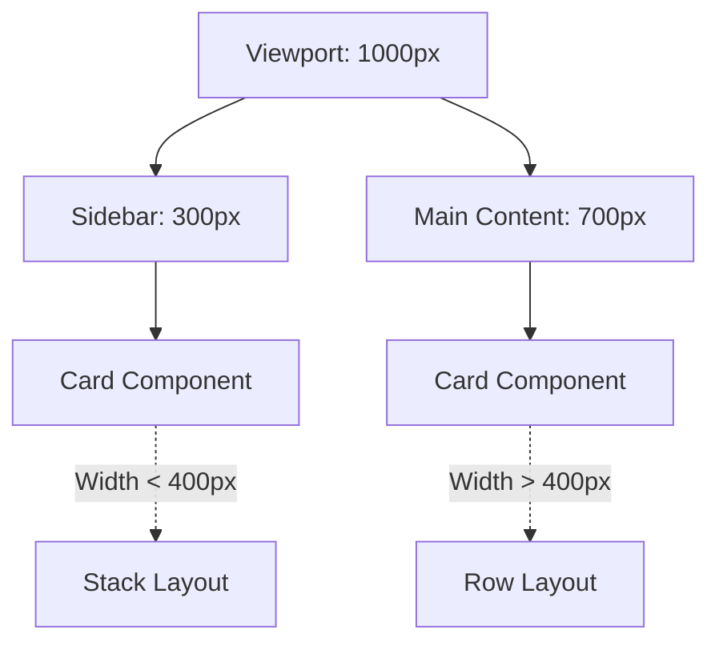

# Container Queries (Контейнерные запросы)

## Суть концепции
Контейнерные запросы (Container Queries) позволяют элементам адаптировать свои стили в зависимости от размера их **родительского контейнера**, а не от размера всего окна браузера (Viewport), как это делают традиционные Media Queries.

## Какую боль мы решаем
Традиционно компоненты (например, карточки) проектировались с учетом ширины экрана: `@media (max-width: 768px)`. Но если одна и та же карточка используется в узком сайдбаре и в широкой основной колонке на десктопе, она будет выглядеть одинаково, опираясь только на ширину экрана. Чтобы это исправить, приходилось плодить классы-модификаторы: `.card--sidebar`, `.card--main`. 

Контейнерные запросы делают компонент по-настоящему независимым: он сам решает, как выглядеть, основываясь на том, сколько места ему выделили.

## Как это работает


Один и тот же код компонента `Card` рендерится по-разному в зависимости от того, куда его поместили.

## Примеры кода

**❌ Антипаттерн: Привязка к Viewport или Модификаторам**
```css
/* Мы привязываем логику карточки к глобальному размеру экрана */
.card { display: flex; flex-direction: row; }

@media (max-width: 768px) {
  .card { flex-direction: column; }
}

/* Или используем модификаторы, нарушая инкапсуляцию */
.sidebar .card { flex-direction: column; }
```

**✅ Правильное решение: Container Queries**
```css
/* 1. Объявляем родителя контейнером */
.sidebar, .main-content {
  container-type: inline-size;
  container-name: layout-wrapper; /* Опционально */
}

/* 2. Компонент реагирует на размер родителя */
.card {
  display: flex;
  flex-direction: column;
}

@container (min-width: 400px) {
  .card {
    flex-direction: row;
  }
}
```

## Неочевидные нюансы и границы применимости
- **Контекст форматирования:** Установка `container-type` создает новый контекст форматирования (containment context). Это значит, что контейнер не влияет на размер своего содержимого так, как обычно (например, он может "схлопнуться", если не задать ему явные размеры или гибкость).
- **Нельзя сделать `container` на `display: contents` или инлайновых элементах.**
- **Единицы измерения:** Появляются новые единицы измерения: `cqw`, `cqh`, `cqi`, `cqb` (например, `font-size: 5cqw;` — 5% от ширины контейнера).
- **Поддержка:** Это относительно новая фича, но сейчас она поддерживается во всех современных браузерах (Baseline 2023). Полифиллы существуют, но они медленные, так как требуют JS-парсинга DOM и ResizeObserver.
