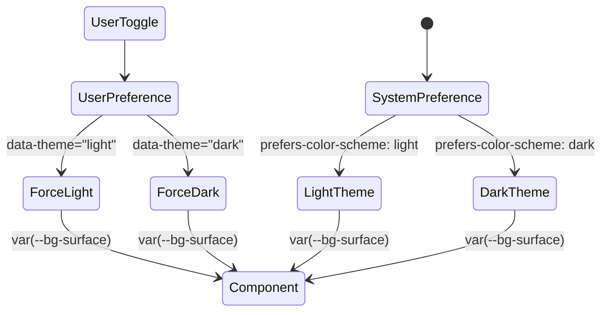

# Dark Mode (Темная тема)

## Суть концепции
Dark Mode — это подход к архитектуре стилей, который позволяет интерфейсу переключаться между светлой и темной цветовыми схемами (а также любыми другими темами). Это достигается за счет отвязки конкретных цветов от компонентов и использования семантических токенов (чаще всего CSS-переменных).

## Какую боль мы решаем
Ранее цвета хардкодились (`background: #ffffff`, `color: #333333`). Когда бизнес просил добавить темную тему для снижения нагрузки на глаза пользователей в ночное время (или для соответствия системным настройкам ОС), приходилось писать тонны переопределяющего CSS (`.dark-mode .card { background: #222; }`), что удваивало объем кода, приводило к ошибкам и усложняло поддержку.

## Как это работает



Система сначала ориентируется на медиа-запрос `prefers-color-scheme`, а затем предоставляет пользователю возможность переопределить эту настройку через UI (сохраняя выбор в `localStorage` и добавляя дата-атрибут на `<html>`).

## Примеры кода

**❌ Антипаттерн: Жесткое кодирование и дублирование**
```css
.button {
  background-color: #ffffff;
  color: #000000;
  border: 1px solid #cccccc;
}

body.dark .button {
  background-color: #1a1a1a;
  color: #ffffff;
  border: 1px solid #333333;
}
```

**✅ Правильное решение: Семантические токены**
```css
/* 1. Базовые переменные (Светлая тема по умолчанию) */
:root {
  --text-primary: #111827;
  --bg-surface: #ffffff;
  --border-subtle: #e5e7eb;
}

/* 2. Темная тема (переопределение) */
@media (prefers-color-scheme: dark) {
  :root {
    --text-primary: #f9fafb;
    --bg-surface: #1f2937;
    --border-subtle: #374151;
  }
}

/* 3. Переопределение пользователем (имеет больший вес) */
[data-theme="dark"] {
  --text-primary: #f9fafb;
  --bg-surface: #1f2937;
  --border-subtle: #374151;
}

/* 4. Использование в компоненте */
.button {
  background-color: var(--bg-surface);
  color: var(--text-primary);
  border: 1px solid var(--border-subtle);
}
```

## Неочевидные нюансы и границы применимости
- **Картинки и Иконки:** Изображения могут быть слишком яркими для темной темы. Используйте `filter: brightness(0.8) contrast(1.2);` или `<picture>` с `media="(prefers-color-scheme: dark)"` для подмены ассетов.
- **Тени (Shadows):** В темной теме традиционные полупрозрачные черные тени (`rgba(0,0,0, 0.1)`) не работают (черное на черном не видно). Вместо этого используют обводки (borders), свечение (light drop shadow) или делают фон "возвышенных" элементов светлее.
- **Вспышка белого (FOUC):** Если выбор темы хранится в JS (`localStorage`), при первой загрузке страницы может произойти короткая вспышка светлой темы, пока скрипт не выполнится и не добавит `data-theme="dark"`. Решается инлайн-скриптом в `<head>` перед рендером body.
