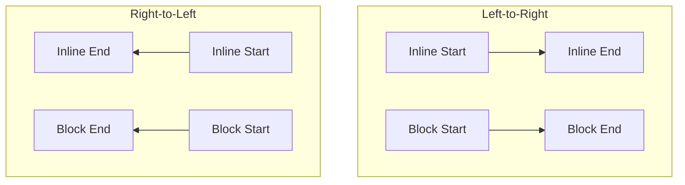

# Logical Properties (Логические свойства)

## Суть концепции
Логические свойства CSS абстрагируют физические направления (`top`, `bottom`, `left`, `right`) в логические оси (`block`, `inline`, `start`, `end`). Это позволяет интерфейсу автоматически адаптироваться к направлению чтения текста — Left-to-Right (LTR), Right-to-Left (RTL) или Top-to-Bottom (вертикальные языки).

## Какую боль мы решаем
При разработке многоязычных сайтов (например, английский + арабский/иврит) возникает проблема: отступ слева (`margin-left`) для иконки в LTR интерфейсе должен стать отступом справа (`margin-right`) в RTL.
Раньше для этого писали сложные сборки (через postcss-rtl) или делали дублирующиеся override-стили с селектором `[dir="rtl"]`. Это порождало баги и раздувало бандл. Логические свойства решают эту проблему на уровне самого CSS-движка браузера.

## Как это работает


- **Inline** — ось, по которой идут слова в строке.
- **Block** — ось, по которой идут абзацы (строки) сверху вниз.
- `margin-left` заменяется на `margin-inline-start`.

## Примеры кода

**❌ Антипаттерн: Физические свойства**
```css
.card {
  padding-left: 20px;
  border-right: 2px solid red;
  margin-top: 10px;
}

/* Приходится переопределять для арабского языка */
[dir="rtl"] .card {
  padding-left: 0;
  padding-right: 20px;
  border-right: none;
  border-left: 2px solid red;
}
```

**✅ Правильное решение: Логические свойства**
```css
.card {
  /* Автоматически отзеркалится в RTL */
  padding-inline-start: 20px; 
  border-inline-end: 2px solid red;
  margin-block-start: 10px;
}
/* Никаких дополнительных CSS для RTL писать не нужно! */
```

## Неочевидные нюансы и границы применимости
- **Shorthands:** Долгое время свойства вроде `margin: 10px 20px` были физическими. Сейчас появились `margin-inline: 20px` и `margin-block: 10px`. Но если вам нужен шорткат со всеми 4 значениями, нужно быть аккуратным — логический шорткат пока не поддерживается повсеместно так же хорошо, как физический.
- **Отладка:** Разработчикам, привыкшим к `left/right`, поначалу тяжело "парсить" глазами `inline-start`. Есть определенный порог входа.
- **Анимации и позиционирование:** Логические свойства отлично работают с `position: absolute` (`inset-inline-start: 0` вместо `left: 0`). Однако, если вы делаете сложные 3D-трансформации или работаете с Canvas/WebGL, там всё остаётся в физических координатах (x, y).
