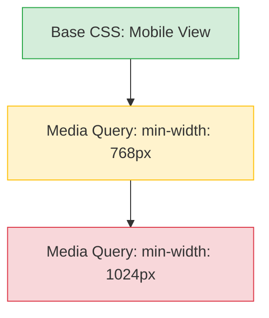

# Mobile First (Мобильный подход)

## Суть концепции
Mobile First — это стратегия проектирования и написания CSS, при которой **базовые стили** (вне медиазапросов) пишутся для мобильных устройств. По мере увеличения экрана (через `@media (min-width: ...)`), интерфейс "прогрессивно улучшается" (Progressive Enhancement), добавляя колонки, декоративные элементы и сложные сетки.

## Какую боль мы решаем
Раньше сайты верстались по подходу Desktop First: сначала десктопная версия, а потом через `@media (max-width: ...)` она "ужималась" под мобилки.
Проблема в том, что мобильные телефоны (с более слабым CPU и интернетом) вынуждены были сначала парсить сложный десктопный CSS, применять его, а затем тут же переопределять его мобильными правилами. Это било по производительности и делало код запутанным.

## Как это работает


Мобильный лейаут обычно самый простой (всё в одну колонку, элементы друг под другом). Писать его как дефолтный — логично и дешево.

## Примеры кода

**❌ Антипаттерн: Desktop First**
```css
.card {
  display: flex;
  flex-direction: row; /* Десктопный лейаут по умолчанию */
  width: 50%;
}

/* Переопределяем для мобилок (оверхед для слабого устройства) */
@media (max-width: 767px) {
  .card {
    flex-direction: column;
    width: 100%;
  }
}
```

**✅ Правильное решение: Mobile First**
```css
/* Мобильный лейаут по умолчанию (быстро и просто) */
.card {
  display: flex;
  flex-direction: column;
  width: 100%;
}

/* Прогрессивное улучшение для больших экранов */
@media (min-width: 768px) {
  .card {
    flex-direction: row;
    width: 50%;
  }
}
```

## Неочевидные нюансы и границы применимости
- **Дизайн-процесс:** Часто дизайнеры рисуют только десктоп, оставляя мобилку "на потом". Верстать Mobile First без мобильных макетов мучительно сложно.
- **Оверхед:** Иногда мобильная версия имеет специфичные UI-паттерны (например, бургер-меню), которые на десктопе вообще не нужны. В таких редких случаях приходится отменять мобильные стили через `min-width`, но это исключение, а не правило.
- **Границы:** Этот подход идеален для контентных сайтов и e-commerce. Для сложных десктопных SaaS-дашбордов, которые на мобилке выглядят совершенно иначе (или вообще не поддерживаются), Mobile First может быть излишним.
