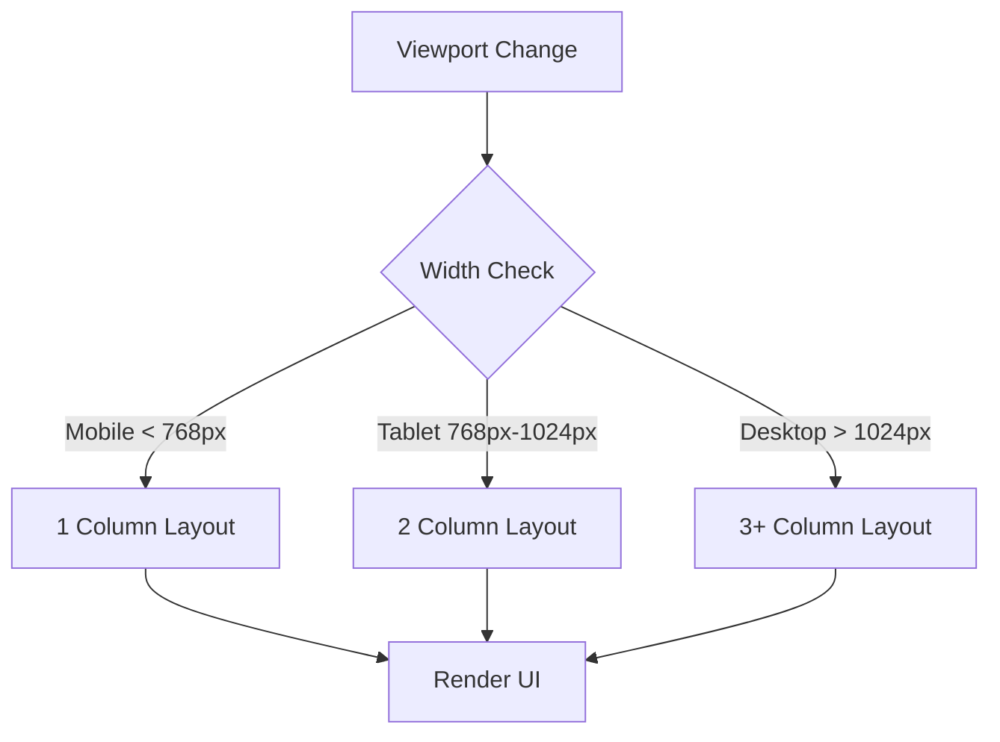

# Responsive Design (Адаптивный дизайн)

## Суть концепции
Responsive Web Design (RWD) — это подход к разработке, при котором веб-страница корректно и удобно отображается на экранах любых устройств (от смарт-часов до ультрашироких мониторов) без необходимости создавать отдельные версии сайта.

Основа RWD держится на трех китах:
1. **Fluid Grids** (Гибкие сетки на основе процентов/фракций, а не пикселей).
2. **Flexible Media** (Адаптивные изображения и видео).
3. **Media Queries** (CSS-правила, применяемые в зависимости от характеристик устройства).

## Какую боль мы решаем
До RWD существовали сайты с жесткой шириной (например, 960px). На смартфонах они выглядели микроскопическими, пользователю приходилось делать зум и скроллить по горизонтали (ужасный UX). Альтернативой было создание отдельного мобильного сайта (m.site.com), что удваивало стоимость разработки, ломало SEO и усложняло шаринг ссылок.

## Как это работает



## Примеры кода

**❌ Антипаттерн: Жесткие размеры и брейкпоинты под устройства**
```css
.container {
  width: 960px; /* Ломается на мобилках */
}

/* Попытка таргетировать конкретный iPhone */
@media (device-width: 375px) and (device-height: 812px) {
  .container { width: 350px; }
}
```

**✅ Правильное решение: Гибкость и относительные единицы**
```css
.container {
  /* Базово занимает всю ширину с небольшими отступами */
  width: 100%;
  padding-inline: 1rem;
  /* Ограничиваем максимальную ширину на огромных экранах */
  max-width: 1200px; 
  margin-inline: auto;
}

img {
  /* Картинка никогда не вылезет за пределы контейнера */
  max-width: 100%;
  height: auto;
}

/* Современный RWD с CSS Grid без медиазапросов! */
.grid {
  display: grid;
  grid-template-columns: repeat(auto-fit, minmax(250px, 1fr));
}
```

## Неочевидные нюансы и границы применимости
- **Pixel Perfect мертв:** В RWD невозможно добиться совпадения дизайна "пиксель-в-пиксель" для каждого промежуточного разрешения (например, на 834px). Дизайн должен быть "резиновым".
- **Сложность тестирования:** Огромная фрагментация Android-устройств требует проверки на реальных девайсах, а не только в Chrome DevTools.
- **Современные функции:** Современный RWD всё чаще отказывается от Media Queries в пользу функций `clamp()`, `min()`, `max()` и Container Queries, позволяя компонентам быть самодостаточными.
