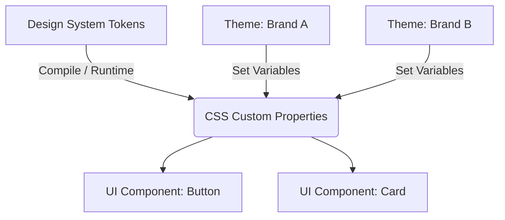

# Theming (Темизация)

## Суть концепции
Темизация (Theming) — это архитектурный подход, позволяющий централизованно изменять визуальное оформление приложения (цвета, типографику, скругления, тени) без изменения структурного CSS и HTML-разметки. По сути, это создание "скинов" для одного и того же UI.

## Какую боль мы решаем
Представьте SaaS-продукт, который продается по модели White-label (разным компаниям под их брендом). У клиента A фирменный цвет красный, квадратные кнопки и шрифт Roboto. У клиента B — синий цвет, скругленные кнопки и шрифт Inter.
Если писать стили жестко, придется дублировать весь CSS или создавать бесконечные классы-переопределения, что превратит кодовую базу в неуправляемый хаос. Темизация решает это через Дизайн-токены.

## Как это работает



Компонент ничего не знает о конкретном цвете. Он знает только, что у него цвет фона равен переменной `--color-brand-primary`. Какая тема загружена в `:root`, так компонент и будет выглядеть.

## Примеры кода

**❌ Антипаттерн: CSS-классы под каждую тему**
```css
/* Раздувание кода и нарушение инкапсуляции */
.button { padding: 10px; }

.theme-alpha .button {
  background: red;
  border-radius: 0;
}

.theme-beta .button {
  background: blue;
  border-radius: 8px;
}
```

**✅ Правильное решение: Токены темы**
```css
/* theme-alpha.css */
:root {
  --color-primary: red;
  --border-radius-base: 0px;
  --font-family: 'Roboto', sans-serif;
}

/* theme-beta.css */
:root {
  --color-primary: blue;
  --border-radius-base: 8px;
  --font-family: 'Inter', sans-serif;
}

/* Базовый CSS компонента (один на все темы) */
.button {
  background-color: var(--color-primary);
  border-radius: var(--border-radius-base);
  font-family: var(--font-family);
  padding: 10px;
}
```

## Неочевидные нюансы и границы применимости
- **Многоуровневые токены:** Токены нужно делить на уровни. 
  - Global: `--blue-500: #0000ff`
  - Semantic: `--color-primary: var(--blue-500)`
  - Component: `--button-bg: var(--color-primary)`. 
  Именно это позволяет гибко менять темы.
- **Оверхед на этапе дизайна:** Темизация требует идеальной синхронизации с командой дизайна. Если дизайнер в макете "Brand B" добавит тень, которой нет в дизайн-системе, придется менять саму структуру компонента, а не только токены.
- **Рантайм vs Билдтайм:** Использование CSS-переменных (рантайм) позволяет переключать темы мгновенно в браузере (как Dark Mode). Если поддержка старых браузеров критична, используется сборка (Sass/Less), где под каждую тему генерируется отдельный `theme-x.css` файл.
