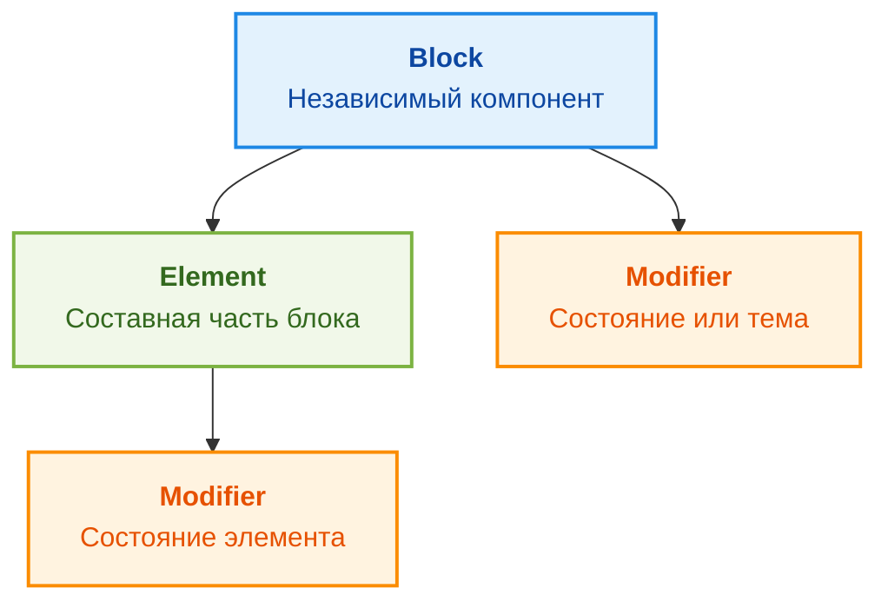

# BEM (Block, Element, Modifier): Инженерный подход к именованию

BEM (БЭМ — Блок, Элемент, Модификатор) — это методология, созданная в Яндексе для решения фундаментальной проблемы CSS: отсутствия встроенной изоляции и предсказуемости имен классов. Это не фреймворк и не библиотека, а строгая система соглашений об именовании, которая делает CSS-код плоским и масштабируемым.

## 1. Какую боль мы решаем?

В классическом подходе разработчики часто дают элементам общие имена (`.title`, `.item`, `.active`). При росте проекта такие имена неизбежно пересекаются. 

Чтобы избежать коллизий, разработчики начинают использовать вложенные селекторы (каскад):
```css
/* Антипаттерн */
.header .menu .item.active { ... }
```
Это приводит к жесткой привязке стилей к структуре HTML и катастрофическому росту специфичности. Если вы захотите перенести `.menu` в `.sidebar`, стили сломаются.

BEM решает эту проблему за счет **плоской структуры** и **уникальных имен**, генерируемых по четким правилам.

## 2. Анатомия BEM

Концепция строится на трех китах:



1.  **Block (Блок):** Самостоятельная, переиспользуемая сущность (существительное). Например: `header`, `button`, `card`.
2.  **Element (Элемент):** Часть блока, которая не имеет смысла вне его контекста. Выделяется двумя подчеркиваниями `__`. Например: `card__title`, `card__image`.
3.  **Modifier (Модификатор):** Флаг, определяющий внешний вид, состояние или поведение блока/элемента. Выделяется двумя тире `--` (или одним подчеркиванием `_` в классическом БЭМ, но `--` популярнее в западном комьюнити). Например: `button--primary`, `card__title--large`.

### Как это выглядит на практике (Хороший паттерн)

```html
<!-- HTML структура -->
<article class="product-card product-card--featured">
  
  <h2 class="product-card__title">SSD Samsung 980 PRO</h2>
  <button class="button button--primary product-card__buy-btn">Купить</button>
</article>
```

```css
/* CSS структура (все селекторы плоские) */
.product-card {
  border: 1px solid #ccc;
  padding: 16px;
}

/* Модификатор блока */
.product-card--featured {
  border-color: gold;
  box-shadow: 0 4px 12px rgba(255, 215, 0, 0.3);
}

/* Элементы */
.product-card__image {
  max-width: 100%;
}

.product-card__title {
  font-size: 1.5rem;
}

/* Элемент как точка монтирования другого блока (Mix) */
.product-card__buy-btn {
  margin-top: auto;
  width: 100%;
}
```

### Важный нюанс: Миксы (Mixes)
Обратите внимание на кнопку в примере выше. Она имеет два класса: `.button` и `.product-card__buy-btn`.
*   `.button` отвечает за внутренний вид самой кнопки (цвет, отступы внутри, скругления).
*   `.product-card__buy-btn` отвечает за позиционирование кнопки *внутри карточки* (внешние отступы, ширина).
Это позволяет сделать блок `.button` абсолютно независимым от контекста.

## 3. Скрытые трейдоффы и оверхед

BEM — мощный инструмент, но у него есть цена:

1.  **Многословность (Verbose HTML):** Имена классов получаются длинными. HTML-код может выглядеть раздутым, особенно в сложных компонентах. `class="nav-menu__item nav-menu__item--active nav-menu__item--disabled"` — обычное дело.
2.  **Ручной контроль:** BEM работает только до тех пор, пока *все* разработчики в команде строго соблюдают конвенцию. Опечатка или лень ("просто вложу селектор") ломает изоляцию.
3.  **Сложность придумывания имен:** Иногда сложно определить, является ли сущность самостоятельным блоком или элементом родителя.

### Антипаттерны BEM (Где система ломается)

**1. Вложенность элементов (Элемент в элементе):**
```css
/* УЖАСНО (Так делать нельзя!) */
.card__header__title { ... }
```
*Почему:* Имя класса привязывается к DOM-дереву. При рефакторинге придется переименовывать классы. Элементы должны принадлежать блоку, а не другим элементам: `.card__title`.

**2. Глобальные селекторы тегов внутри блоков:**
```css
/* ПЛОХО */
.card p { ... }
```
*Почему:* Ломается инкапсуляция. Если внутри `<p>` окажется другой блок, его стили могут конфликтануть.

## 4. Границы применимости

*   **Где BEM идеален:**
    *   Проекты на чистом HTML/JS (без сборщиков и фреймворков).
    *   Глобальные UI-библиотеки, где нужно минимизировать конфликты со стилями пользовательского проекта.
    *   Legacy-проекты с глобальным CSS (BEM — лучший способ начать наводить порядок в хаосе).
*   **Где лучше выбрать другой инструмент:**
    *   Современные SPA на React/Vue, использующие **CSS Modules** или **CSS-in-JS**. В этих инструментах изоляция классов происходит на уровне сборки (хэширование имен). В связке с CSS Modules использование BEM часто становится избыточным (хотя некоторые команды используют упрощенный BEM внутри модулей для самодокументации).