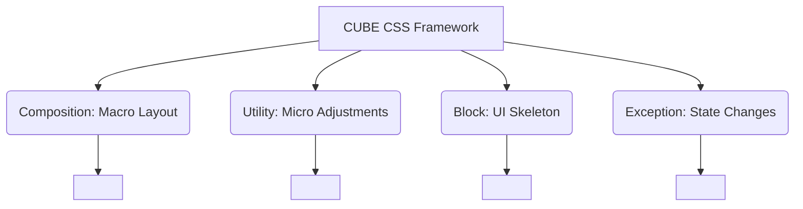

# CUBE CSS

## Суть концепции
CUBE CSS (Composition, Utility, Block, Exception) — это современная методология от Энди Белла, созданная как альтернатива слишком строгому БЭМу и HTML-загрязняющему Tailwind. CUBE предлагает использовать нативный каскад CSS (которого так боятся в БЭМ) и современные возможности браузеров (Grid, Flexbox, Custom Properties).

Расшифровка:
- **C (Composition):** Глобальные лейауты и сетки, определяющие, *как* элементы располагаются (например, макро-сетка страницы).
- **U (Utility):** Классы-помощники, делающие ровно одну вещь (например, `.text-center`, `.bg-primary`).
- **B (Block):** Компоненты UI (карточки, кнопки). Пишется только *скелет* компонента.
- **E (Exception):** Исключения или состояния компонента. Часто реализуются через data-атрибуты.

## Какую боль мы решаем
БЭМ заставлял нас писать `.card__title` и `.card__text`, полностью убивая каскад. Tailwind заставляет писать по 20 классов в HTML. CUBE пытается найти золотую середину: компонент должен быть описан минимальным CSS, а его вариативность достигается утилитами и data-атрибутами.

## Как это работает



## Примеры кода

**❌ Антипаттерн (БЭМ-стайл в мире CUBE):**
```css
.card { display: flex; flex-direction: column; background: white; }
.card__title { font-size: 1.5rem; font-weight: bold; margin-bottom: 1rem; }
.card--dark { background: black; color: white; }
```

**✅ Правильное решение (CUBE CSS):**
```html
<!-- Собираем из кубиков (композиция + блок + утилиты) -->
<article class="l-flow card bg-dark" data-state="featured">
  <h2>Title</h2>
  <p>Content</p>
</article>
```
```css
/* Утилита для потока (Composition) - расставляет отступы между всеми дочерними элементами */
.l-flow > * + * { margin-block-start: 1em; }

/* Block - только скелет */
.card { padding: 1.5rem; border-radius: 8px; }

/* Exception - переопределение через data-атрибут */
.card[data-state="featured"] { border: 2px solid var(--color-brand); }
```

## Неочевидные нюансы и границы применимости
- **Доверие к каскаду:** CUBE поощряет написание глобальных стилей (например, стилизация всех `h2` по умолчанию). В больших legacy-проектах без жесткой дизайн-системы это может привести к непредсказуемым конфликтам.
- **Грань между B и U:** Разработчикам часто сложно решить: вынести свойство в класс блока (`.card { text-align: center; }`) или навесить утилиту (`<article class="card text-center">`). Требуется хорошая документация и конвенции в команде.
