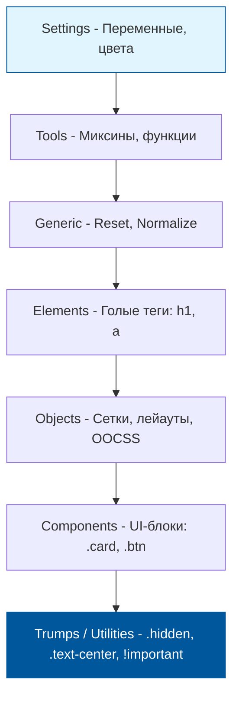

# ITCSS (Inverted Triangle CSS)

## Суть концепции
ITCSS (Inverted Triangle CSS) — это архитектурный паттерн (автор: Харри Робертс), который помогает организовать файлы и структуру CSS-кода в крупных проектах. Его главная цель — управлять **специфичностью** (Specificity) селекторов. Код пишется и подключается строго от самых глобальных и слабоспецифичных правил к самым локальным и высокоспецифичным.

## Какую боль мы решаем
В CSS порядок подключения файлов имеет критическое значение (каскад). Если общие стили (`reset.css`) подключить после стилей компонентов, всё сломается. Разработчики часто начинают "перебивать" стили друг друга: сначала используют `.card`, потом `.main .card`, потом `#sidebar .card`, и в конце концов срываются на `!important`. ITCSS решает проблему войн специфичности.

## Как это работает


Каждый следующий слой в треугольнике становится всё более "узким" (охватывает меньше элементов) и более "тяжелым" (имеет большую специфичность).

## Примеры кода

**❌ Антипаттерн: Хаотичный импорт в `main.scss`**
```scss
@import "components/header";
@import "components/button";
@import "variables"; /* Ошибка: переменные подключены поздно */
@import "reset";     /* Ошибка: ресет убьет стили компонентов выше */
```

**✅ Правильное решение: Строгий порядок ITCSS**
```scss
/* 1. Settings */
@import "settings/colors";
/* 2. Tools */
@import "tools/mixins";
/* 3. Generic */
@import "generic/normalize";
/* 4. Elements */
@import "elements/typography";
/* 5. Objects */
@import "objects/grid";
/* 6. Components */
@import "components/button";
@import "components/card";
/* 7. Trumps (Утилиты) */
@import "trumps/utilities"; 
```

## Неочевидные нюансы и границы применимости
- **Нативная замена:** Сегодня архитектуру ITCSS можно элегантно реализовать нативно через **Cascade Layers (`@layer`)**. Вместо контроля порядка файлов, вы декларируете: `@layer reset, elements, components, utilities;`, и браузер сам сортирует приоритеты.
- **Масштаб:** Для маленького проекта (лендинга) заводить 7 папок — это дикий оверхед. ITCSS нужен там, где CSS весит сотни килобайт и поддерживается десятками разработчиков.
- **Trumps и !important:** Это единственный слой, где разрешено (и даже рекомендуется) использовать `!important`, чтобы гарантированно переопределить любой компонент (например, класс `.d-none { display: none !important; }`).
