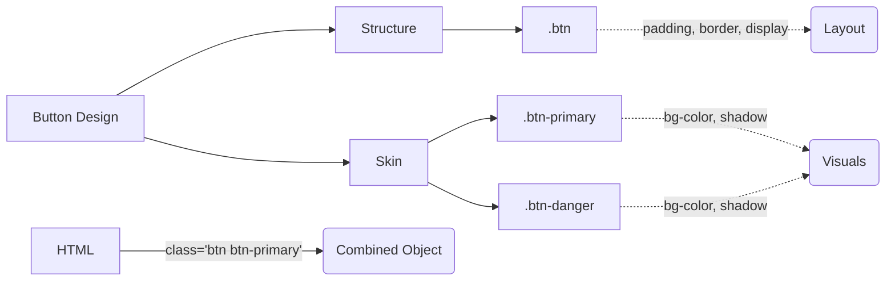

# OOCSS (Object-Oriented CSS)

## Суть концепции
OOCSS (Объектно-Ориентированный CSS), предложенный Николь Салливан в 2009 году, стал первой попыткой перенести инженерные практики DRY (Don't Repeat Yourself) в мир CSS. Методология базируется на двух главных принципах:
1. **Разделение структуры и внешнего вида (скина).**
2. **Разделение контейнера и контента.**

## Какую боль мы решаем
До OOCSS разработчики верстали "страницами". У сайдбара была своя кнопка, у хедера — своя, с огромным дублированием CSS-кода (у обеих кнопок были одинаковые градиенты, бордеры, отступы). CSS-файлы разрастались до невероятных размеров, а изменить дизайн (например, сделать все кнопки более скругленными) было практически невозможно.

## Как это работает



## Примеры кода

**❌ Антипаттерн: Привязка к контейнеру и смешивание стилей**
```css
/* Кнопка жестко привязана к хедеру. Структура и цвета смешаны в одном классе. */
#header .buy-button {
  display: inline-block;
  padding: 10px 20px;
  background: blue;
  color: white;
  border-radius: 5px;
  box-shadow: 0 2px 4px rgba(0,0,0,0.2);
}
```

**✅ Правильное решение: OOCSS**
```css
/* 1. Разделение структуры (.btn) и скина (.btn-primary) */
.btn {
  display: inline-block;
  padding: 10px 20px;
  border-radius: 5px;
}

.btn-primary {
  background: blue;
  color: white;
  box-shadow: 0 2px 4px rgba(0,0,0,0.2);
}

/* 2. Разделение контейнера и контента */
/* Кнопку можно использовать ГДЕ УГОДНО, она не знает про #header */
```
```html
<button class="btn btn-primary">Buy</button>
```

## Неочевидные нюансы и границы применимости
- **HTML Bloat:** Поскольку стили разбиваются на множество мелких классов, HTML-разметка начинает обрастать классами (`class="media p-left btn btn-primary shadow"`).
- **Историческое наследие:** Сегодня "чистый" OOCSS редко упоминают как отдельную методологию. Его идеи полностью растворились и стали фундаментом для БЭМ (где Скин = Модификатор) и Utility-First фреймворков вроде Bootstrap и Tailwind CSS.
- **Оверхед на абстракции:** Разделение слишком мелких сущностей (например, создание отдельного класса `.shadow-2` только ради OOCSS) может усложнить чтение кода для новичков.
