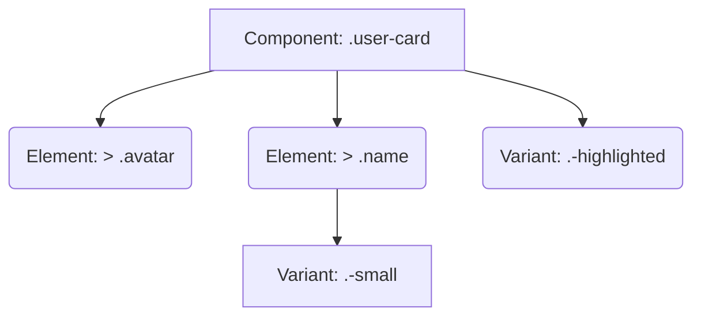

# RSCSS (Reasonable System for CSS Styles)

## Суть концепции
RSCSS — это легковесная методология стилизации, созданная как "разумная" альтернатива БЭМ (BEM). RSCSS сохраняет компонентный подход, но избавляет разработчиков от написания длинных уродливых классов с двойными подчеркиваниями (`__`) и двойными тире (`--`).

Три кита RSCSS:
1. **Компоненты (Components):** Всегда называются двумя словами через дефис (например, `.search-form`, `.user-card`), чтобы не пересекаться с нативными HTML-тегами.
2. **Элементы (Elements):** Внутренние части компонента. Называются ОДНИМ словом (`.title`, `.field`). Обязательно используются с дочерним селектором `>`.
3. **Варианты (Variants / Модификаторы):** Начинаются с префикса дефиса (например, `.-active`, `.-large`).

## Какую боль мы решаем
БЭМ (Block, Element, Modifier) великолепно решает проблему инкапсуляции, но порождает визуальный шум в HTML: `<div class="card__button card__button--primary card__button--large">`. RSCSS делает код опрятнее и короче.

## Как это работает



## Примеры кода

**❌ Антипаттерн (БЭМ-подход, от которого мы уходим):**
```html
<article class="product-card product-card--featured">
  
  <h3 class="product-card__title">...</h3>
</article>
```

**✅ Правильное решение (RSCSS):**
```html
<article class="product-card -featured">
  
  <h3 class="title">...</h3>
</article>
```
```css
/* CSS пишется через вложенность (Sass/Less/Native Nesting) и селектор дочерних элементов > */
.product-card {
  background: white;

  &.-featured { border: 2px solid gold; }

  > .image { width: 100%; }
  
  > .title { font-size: 20px; }
}
```

## Неочевидные нюансы и границы применимости
- **Хрупкость DOM-дерева:** Использование строгого дочернего селектора `>` означает, что стили жестко привязаны к HTML-структуре. Если вам понадобится обернуть `.image` в дополнительный `div` (например, для анимации), стили `.product-card > .image` сломаются. БЭМ в этом плане надежнее, так как не зависит от вложенности.
- **Конфликты с глобальными стилями:** Элементы называются одним словом (`.title`). Если вы забудете селектор `>` или сделаете глобальный класс `.title`, начнутся конфликты.
- **Варианты (Модификаторы):** Классы, начинающиеся с дефиса (`.-active`), валидны в спецификации CSS, но могут сбить с толку линтеры (Stylelint) или парсеры в некоторых старых JS-библиотеках.
