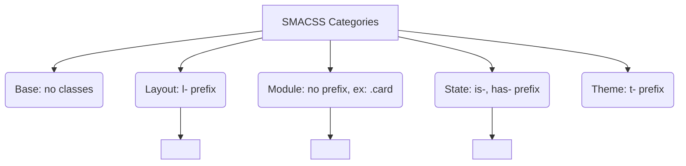

# SMACSS (Scalable and Modular Architecture for CSS)

## Суть концепции
SMACSS (масштабируемая и модульная архитектура для CSS) — это методология, предложенная Джонатаном Снуком в 2011 году. В отличие от OOCSS, которая была скорее философской, SMACSS предложила жесткую категоризацию всех CSS-правил в проекте на 5 групп:
1. **Base** — Базовые стили (голые теги `html`, `a`, `ul`).
2. **Layout** — Макро-сетка (структура страницы: шапка, сайдбар, футер).
3. **Module** — Переиспользуемые UI-компоненты (карточки, аккордеоны).
4. **State** — Состояния модулей (активный, скрытый, ошибка).
5. **Theme** — Визуальное оформление (темизация).

## Какую боль мы решаем
В крупных проектах CSS превращался в "спагетти". Никто не понимал, где лежат стили сетки, а где — стили конкретной кнопки. SMACSS ввел строгие префиксы для классов, что позволило разработчикам читать HTML и сразу понимать, за что отвечает класс.

## Как это работает



## Примеры кода

**❌ Антипаттерн: Смешивание лейаута, модуля и состояния**
```css
/* Модуль сам определяет свою ширину и позицию, его нельзя переиспользовать */
.user-profile {
  float: left;
  width: 300px;
  background: #eee;
  border-radius: 4px;
}
/* Состояние слито с модулем */
.user-profile-active { background: #ccc; }
```

**✅ Правильное решение: SMACSS**
```css
/* Layout (сетка) */
.l-sidebar { width: 300px; float: left; }

/* Module (независимый компонент) */
.user-profile { background: #eee; border-radius: 4px; }

/* State (состояние) */
.is-active { background: #ccc; }
```
```html
<div class="l-sidebar">
  <div class="user-profile is-active">...</div>
</div>
```

## Неочевидные нюансы и границы применимости
- **Наследие:** Сегодня SMACSS в чистом виде используется редко. Однако его идея префиксов состояний (`.is-active`, `.has-dropdown`) стала стандартом де-факто в индустрии и повсеместно используется вместе с БЭМ.
- **Глобальные State-классы:** Правило `.is-active { display: block; }` может конфликтовать с разными модулями, которым при активации нужен `display: flex` или `color: red`. Поэтому часто состояния все равно привязывают к модулю: `.user-profile.is-active`.
- **Layout:** В эпоху CSS Grid и Flexbox выносить макро-лейауты в отдельные `l-` классы часто излишне, так как сетка задается одним правилом у родительского контейнера.
