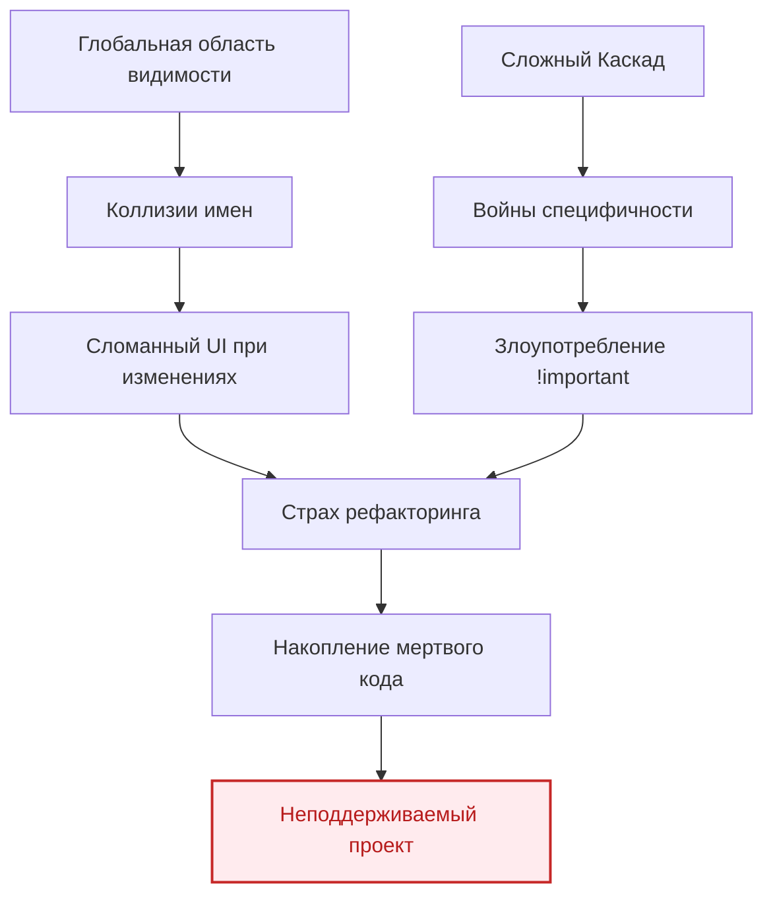

# Архитектура CSS: Укрощение хаоса

Исторически CSS создавался для стилизации простых текстовых документов. Однако с появлением сложных веб-приложений (Single Page Applications) базовых возможностей CSS стало катастрофически не хватать. Отсутствие строгих правил и глобальная область видимости превратили поддержку стилей в крупных проектах в настоящий кошмар для инженеров.

## 1. Какую боль мы решаем?

Без продуманной архитектуры CSS быстро деградирует. Основные проблемы, с которыми сталкиваются команды:

*   **Глобальная область видимости (Global Scope):** Любой селектор в CSS по умолчанию глобален. Изменение стиля `.button` в одном файле может неожиданно сломать кнопку в совершенно другом конце приложения.
*   **Войны специфичности (Specificity Wars):** Когда два селектора претендуют на один элемент, побеждает тот, у кого выше специфичность. Разработчики начинают писать безумные конструкции вроде `.header .nav ul li a.active`, чтобы переопределить стили.
*   **Злоупотребление `!important`:** Как следствие войн специфичности, `!important` становится "ядерной кнопкой", которая окончательно ломает каскад и делает код непредсказуемым.
*   **Мертвый код (Dead Code):** Из-за страха сломать существующий UI разработчики боятся удалять старые стили. Файлы разрастаются, увеличивая размер бандла.



## 2. Принципы хорошей CSS-архитектуры

Хорошая архитектура стилей должна делать код предсказуемым, изолированным и переиспользуемым. 

### Антипаттерн (Как не надо делать)
```css
/* Глобальные и слишком вложенные селекторы */
#app .main-content div.card h2 {
  color: blue;
  font-size: 20px;
}

/* Использование !important для переопределения */
.promo-title {
  color: red !important;
}
```
*Почему это плохо?* При изменении структуры HTML (например, `div.card` заменят на `article.card`) стили отвалятся. А `!important` сделает невозможным дальнейшее переопределение цвета для `.promo-title`.

### Хороший инженерный подход
Независимо от того, используете ли вы BEM, CSS Modules или Tailwind, хорошая архитектура стремится к плоской структуре и изоляции:

```css
/* Плоская структура (на примере BEM) */
.card {
  background: white;
  border-radius: 8px;
}

.card__title {
  color: blue;
  font-size: 20px;
}

.card__title--promo {
  color: red; /* Переопределение модификатором, без !important */
}
```

## 3. Треугольник компромиссов (Трейдоффы)

При выборе способа стилизации архитекторы всегда балансируют между тремя факторами:

1.  **Скорость разработки (Developer Experience):** Насколько быстро можно набросать UI?
2.  **Производительность (Performance):** Сколько байт нужно отправить клиенту и как быстро браузер отрендерит страницу?
3.  **Изоляция и безопасность (Isolation):** Насколько сложно случайно сломать чужой компонент?

Например, **Utility-first (Tailwind)** дает максимальную скорость разработки и идеальную изоляцию (нет кастомных CSS-классов), но страдает читаемость HTML. **CSS-in-JS (Styled Components)** дает потрясающий Developer Experience и типизацию, но приносит оверхед в виде рантайм-вычислений и увеличения размера JS-бандла.

## 4. Границы применимости

*   **Когда архитектура необходима:**
    *   Проекты с долгим жизненным циклом (от 1 года).
    *   Наличие в команде более 2-3 фронтенд-разработчиков.
    *   Создание собственной библиотеки UI-компонентов (Design System).
*   **Когда она избыточна:**
    *   Быстрые прототипы, хакатоны.
    *   Одностраничные лендинги с нулевой логикой, где важнее просто быстро сверстать по макету. В таких случаях можно обойтись простым глобальным файлом со стилями без сложных абстракций.
