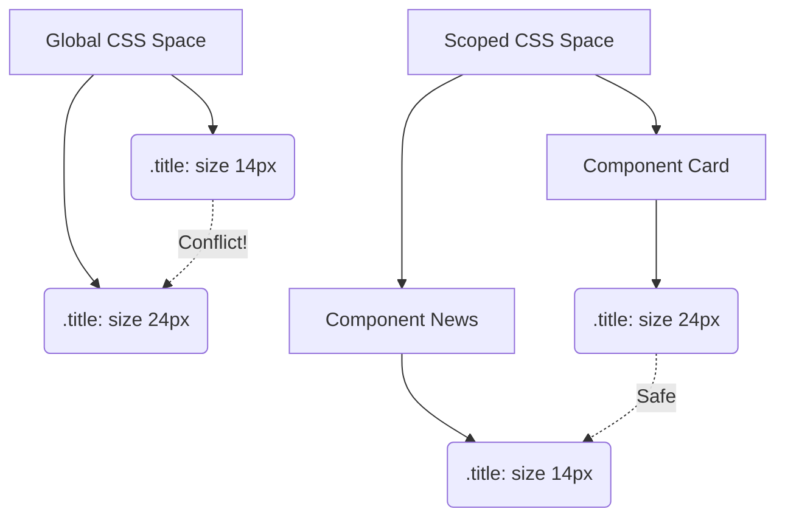

# CSS Scope (Область видимости)

## Суть концепции
CSS по своей природе **глобален**. Любое правило, написанное в любом файле, применяется ко всему документу. CSS Scope (Область видимости) — это концепция изоляции стилей, гарантирующая, что CSS, написанный для одного компонента, не "утечет" и не сломает другие компоненты на странице.

Исторически эта проблема решалась конвенциями (БЭМ), затем инструментами сборки (CSS Modules), и наконец — на уровне веб-стандартов (Shadow DOM, `@scope`).

## Какую боль мы решаем
Представьте, что вы сверстали компонент `<div class="card"><h2 class="title">...</h2></div>` и написали `.title { font-size: 24px; }`.
Через месяц другой разработчик создает виджет новостей и пишет `.title { font-size: 14px; text-transform: uppercase; }`.
Так как CSS глобален, стили сливаются. Тот, кто подключен позже в `<head>`, побеждает. В итоге ваша карточка внезапно становится с маленьким текстом в верхнем регистре (Style Leak).

## Как это работает



## Примеры кода

**❌ Антипаттерн: Глобальные имена классов без префиксов**
```css
/* Опасно: этот стиль может примениться к любому элементу .button на сайте */
.button { background: red; }
```

**✅ Правильное решение 1: Инструментальный Scope (CSS Modules / Vue Scoped)**
Большинство фреймворков решают это под капотом, добавляя уникальные хэши:
```html
<!-- Vue / Svelte Scoped CSS -->
<button class="button[data-v-f3f3eg9]">...</button>
```
```css
/* CSS Modules генерация */
.button_x8f9a { background: red; }
```

**✅ Правильное решение 2: Нативный `@scope` (CSS Scope API)**
```css
/* Стили применяются только внутри .card, но НЕ проникают внутрь .card__slot (эффект "бублика") */
@scope (.card) to (.card__slot) {
  img { border-radius: 10px; }
  .title { font-size: 24px; }
}
```

## Неочевидные нюансы и границы применимости
- **Нативный `@scope` имеет границы:** Самая мощная фича нативного скоупа — возможность задать не только верхнюю границу (root), но и нижнюю (limit). Это позволяет защитить внутренние слоты (children) компонента от родительских стилей.
- **Специфичность:** Нативный `@scope` дает правилам особый вес "близости" (Proximity). Если есть два конфликтующих правила, победит то, чей скоуп находится ближе к элементу в DOM-дереве (наконец-то физическое расположение элемента влияет на специфичность!).
- **Shadow DOM:** Самый строгий вид скоупинга — Shadow DOM (используется в Web Components). Он изолирует стили намертво, даже глобальный `body { color: red }` не проникает внутрь Shadow DOM (в отличие от `@scope` и CSS Modules).
