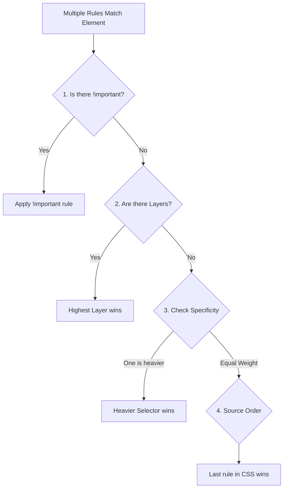

# Cascade (Каскад)

## Суть концепции
Каскад — это фундаментальный алгоритм CSS (Cascading Style Sheets), который определяет, какое именно свойство будет применено к HTML-элементу, если на это свойство претендуют несколько разных CSS-правил. 

Алгоритм каскада оценивает правила в строгом порядке:
1. **Importance (`!important`)** и происхождение (Стили браузера < Стили автора < Стили пользователя).
2. **Context** (Shadow DOM контекст).
3. **Cascade Layers** (Слои `@layer`).
4. **Specificity** (Специфичность / Вес селектора).
5. **Order of appearance** (Порядок появления: кто подключен последним, тот и прав).

## Какую боль мы решаем
Непонимание каскада — главная причина фрустрации при работе с CSS. Разработчик пишет класс, но он "почему-то не применяется". Начинается война `!important`, которая превращает кодовую базу в не поддерживаемый ад. Понимание каскада позволяет писать предсказуемый и легко переопределяемый код.

## Как это работает



## Примеры кода

**❌ Антипаттерн: Игнорирование каскада**
```css
/* Разработчик думает, что это правило победит, так как оно ниже */
.card { background: white; }
.card.is-active { background: blue; }

/* Но в другом файле (выше по коду) кто-то написал: */
div#main .card { background: red; } 
/* Красный победит из-за специфичности (наличие ID)! Синий не сработает. */
```

**✅ Правильное решение: Работа в гармонии с каскадом**
```css
/* Все селекторы имеют одинаковый вес (1 класс) */
.card { background: white; }
.card-active { background: blue; }
.card-error { background: red; }
/* Теперь каскад разрешается 5-м пунктом (Source Order). Последний класс в HTML/CSS победит. */
```

## Неочевидные нюансы и границы применимости
- **Анимации ломают каскад:** Правила, применяемые во время `@keyframes` анимаций, временно перекрывают даже `!important` декларации обычного каскада.
- **Враг компонентов:** В эпоху React/Vue глобальный каскад часто рассматривается как враг (он вызывает утечку стилей). Поэтому такие инструменты, как CSS Modules и Styled Components, генерируют уникальные хэш-классы, искусственно сводя каскад (конфликты) к нулю.
- **Пользовательские стили:** В каскаде заложена мощная фича доступности. Если слабовидящий пользователь в настройках браузера установит `!important` для размера шрифта, этот стиль победит авторский `!important` (стиль разработчика).
