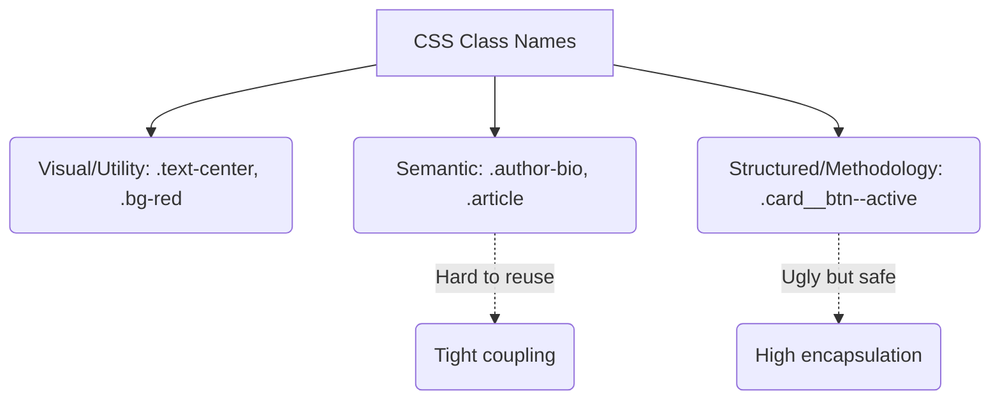

# Naming Conventions (Соглашения по именованию)

## Суть концепции
Naming Conventions — это набор правил, по которым команда разработчиков называет CSS-классы. Поскольку CSS не имеет встроенных пространств имен (namespaces) или строгой типизации, именно конвенции помогают понимать, к чему относится класс, какова его структура и можно ли его безопасно удалить или изменить.

Самые популярные конвенции: BEM, RSCSS, SUIT CSS, OOCSS-подобный нейминг (Bootstrap).

## Какую боль мы решаем
Если нет правил, разработчики называют классы как попало:
- Вася пишет `.SubmitBtn` (CamelCase).
- Петя пишет `.red-button` (Визуальный нейминг).
- Маша пишет `.form_submit` (Snake_case).
Когда проект растет, классы начинают пересекаться, их семантика теряется. Непонятно: класс `.active` относится к кнопке, к пункту меню или это глобальный стейт?

## Как это работает



## Примеры кода

**❌ Антипаттерн: Визуальный нейминг и отсутствие структуры**
```html
<!-- Если дизайн поменяется и кнопка станет синей, имя класса станет абсурдным -->
<button class="red-button large float-left">Click</button>
```

**✅ Правильное решение: Структурный (BEM) или Функциональный нейминг**
```html
<!-- BEM (Block Element Modifier) - Четко понятно, что к чему относится -->
<button class="button button--large button--primary">Click</button>

<!-- Компонентный префикс (защита от коллизий) -->
<button class="c-button is-loading">Click</button>
```

## Неочевидные нюансы и границы применимости
- **Размер HTML:** Строгие конвенции вроде БЭМ (`.product-card__image-wrapper`) делают HTML-разметку огромной и тяжелой для чтения.
- **Инструментарий решает проблему:** В современных стеках (React/Vue) с использованием CSS Modules или CSS-in-JS, строгие конвенции именования практически вымерли. Сборщик сам генерирует классы вида `.Button_root__2k1l`, поэтому разработчик может называть класс просто `.wrapper` или `.root` внутри своего файла, не боясь коллизий.
- **Utility-First исключение:** В парадигме Tailwind конвенции сводятся к заучиванию аббревиатур фреймворка (`pt-4`, `flex`, `items-center`). Там кастомные имена классов вообще стараются не придумывать.
