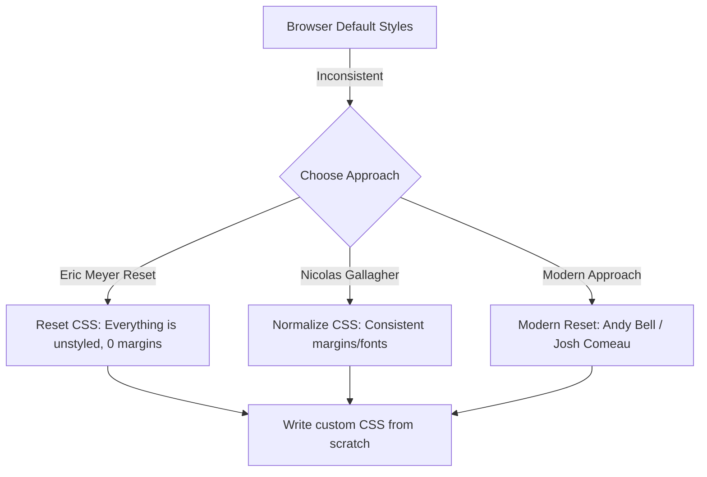

# Reset и Normalize

## Суть концепции
Браузеры (Chrome, Safari, Firefox) по умолчанию применяют к HTML-документу свои собственные стили — **User Agent Stylesheet**. Например, браузер сам решает, какие отступы будут у тега `<body>`, как выглядит кнопка `<button>` и какого размера будет `<h1>`. Проблема в том, что эти стили немного отличаются от браузера к браузеру.

Для выравнивания этих различий используются два подхода:
1. **Reset CSS:** "Выжженная земля". Сбрасывает абсолютно все стили (margin, padding, font-size) в ноль.
2. **Normalize CSS:** "Мягкое выравнивание". Сохраняет полезные дефолты браузера (например, `h1` все еще большой), но делает их одинаковыми во всех браузерах и исправляет известные баги.

## Какую боль мы решаем
Кроссбраузерная несовместимость. Без сброса стилей верстка, которая идеально выглядит в Chrome, может "поехать" в Safari из-за того, что у `ul` там другой дефолтный `padding-left`. Кроме того, стандартная блочная модель (когда padding увеличивает размер элемента) крайне неудобна для верстки.

## Как это работает



## Примеры кода

**❌ Антипаттерн: Верстка без сброса базовых стилей**
```css
/* Разработчик не сбросил box-sizing. 
   Ширина элемента будет не 100%, а 100% + 40px (padding) + 2px (border).
   В итоге появится горизонтальный скролл! */
.container {
  width: 100%;
  padding: 20px;
  border: 1px solid black;
}
```

**✅ Правильное решение: Современный базовый Reset**
```css
/* Фундамент любой современной верстки (Modern Reset) */

/* 1. Интуитивная блочная модель для всех элементов */
*, *::before, *::after {
  box-sizing: border-box;
}

/* 2. Убираем дефолтные отступы */
* {
  margin: 0;
  padding: 0;
}

/* 3. Делаем картинки адаптивными по умолчанию */
img, picture, video, canvas, svg {
  display: block;
  max-width: 100%;
}

/* 4. Наследуем шрифты в формах (иначе у кнопок и инпутов будет дефолтный шрифт ОС) */
input, button, textarea, select {
  font: inherit;
}
```

## Неочевидные нюансы и границы применимости
- **Reset vs Normalize:** Старый агрессивный Reset (от Эрика Майера) заставлял писать CSS для элементарных вещей (тег `<strong>` переставал быть жирным). Поэтому индустрия перешла на Normalize, а затем на кастомные микро-ресеты (как в примере выше).
- **Сброс кнопок:** Кнопка `<button>` — один из самых упрямых элементов. Даже при ресете она может сохранять `background` и `border` в Safari на iOS. Часто приходится делать полный сброс: `all: unset;` (но осторожно, это убьет и фокус!).
- **Фреймворки:** Если вы используете Tailwind, Bootstrap или MUI, они **уже содержат** встроенный Reset (например, `Preflight` в Tailwind). Добавлять свой `reset.css` в таких случаях не нужно — это вызовет конфликты.
