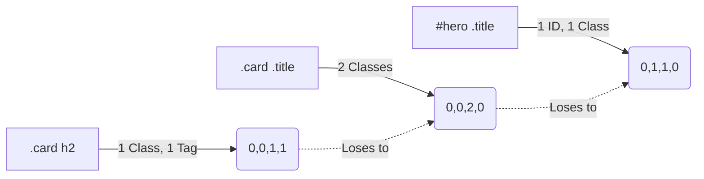

# Specificity (Специфичность)

## Суть концепции
Специфичность (Вес селектора) — это встроенный в CSS механизм подсчета "важности" правила. Когда к одному элементу применяются два конфликтующих стиля из разных селекторов, браузер использует простую математику для определения победителя.

Вес селектора измеряется в четырех регистрах: `(A, B, C, D)`
- **A:** Инлайн-стили (`style="..."`) = `1,0,0,0`
- **B:** ID (`#header`) = `0,1,0,0`
- **C:** Классы, псевдоклассы (`:hover`), атрибуты (`[type="text"]`) = `0,0,1,0`
- **D:** Теги (`div`, `h1`), псевдоэлементы (`::before`) = `0,0,0,1`

## Какую боль мы решаем
Если разработчик не понимает специфичность, он начинает писать слишком длинные селекторы. Затем, пытаясь переопределить их в мобильной версии, он сталкивается с тем, что класс не применяется. Итог — повсеместное использование `!important`, которое полностью ломает масштабируемость проекта.

## Как это работает


Сравнение идет слева направо. Один ID (`0,1,0,0`) перевесит хоть тысячу классов (`0,0,1000,0`).

## Примеры кода

**❌ Антипаттерн: Избыточная специфичность (Вредная связность)**
```css
/* Вес: 0,1,2,2 - ОЧЕНЬ ТЯЖЕЛО ПЕРЕОПРЕДЕЛИТЬ */
#main-content div.article a.link { color: blue; }

/* При попытке сменить цвет при наведении ничего не выйдет */
.link:hover { color: red; } /* Вес: 0,0,2,0 (Меньше, чем у правила выше) */
```

**✅ Правильное решение: Плоская специфичность (Flat Specificity)**
```css
/* Сохраняем вес минимальным. Используем только классы (Вес: 0,0,1,0) */
.article-link { color: blue; }

/* Легко переопределяется другим классом (Вес: 0,0,2,0) */
.article-link:hover { color: red; }
```

## Неочевидные нюансы и границы применимости
- **`!important`:** Не участвует в обычной математике специфичности. Он создает параллельное измерение. Правило с `!important` бьет всё (даже инлайн-стили). Перебить его можно только другим `!important`, у которого селектор имеет больший вес. Это путь в никуда.
- **Универсальный селектор `*` и комбинаторы (`>`, `+`, `~`):** Не имеют веса (0,0,0,0). Они не добавляют специфичности селектору.
- **Псевдокласс `:not()`, `:is()`, `:has()`:** Сами по себе не имеют веса, но принимают вес **самого сильного** селектора, переданного внутрь них. Например, `:not(#hero)` будет весить как один ID (`0,1,0,0`). А вот `:where()` — это читерство, он обнуляет вес всего, что внутри (всегда `0,0,0,0`).
