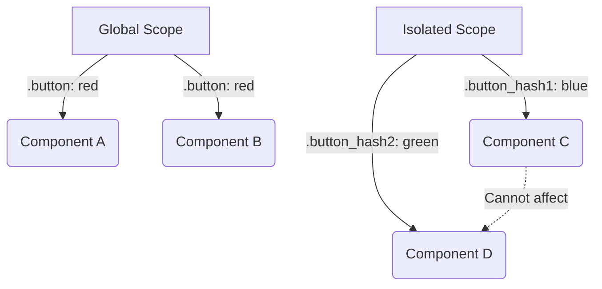

# Style Isolation (Изоляция стилей)

## Суть концепции
Изоляция стилей (Style Isolation/Scoping) — это механизм или архитектурный подход, который гарантирует, что CSS-код одного компонента:
1. **Не утекает наружу** (не ломает другие компоненты).
2. **Не протекает внутрь** (глобальные стили случайно не ломают сам компонент).

В современной разработке компонент (например, `<Card />`) должен быть "черным ящиком", который выглядит одинаково, куда бы его ни вставили.

## Какую боль мы решаем
По умолчанию CSS глобален. Если вы написали `.title { font-size: 20px; }` для карточки товара, а на странице новостей кто-то написал `.title { font-size: 14px; text-transform: uppercase; }`, возникнет коллизия. Победит тот, чей код загрузился последним или чей селектор специфичнее (проблема Style Leakage). Это превращает рефакторинг в саперное дело: удаляя/изменяя класс, вы никогда не знаете, что сломается на других страницах.

## Как это работает



## Примеры кода

**❌ Антипаттерн: Глобальные конфликтующие классы**
```css
/* header.css */
.nav-item { padding: 10px; color: blue; }

/* sidebar.css (подключен позже, сломает хедер!) */
.nav-item { padding: 5px; color: gray; } 
```

**✅ Правильное решение: Изоляция (например, CSS Modules)**
```javascript
// Header.jsx
import styles from './Header.module.css';
// Под капотом станет: <div class="Header_navItem__3f9k2">
<div className={styles.navItem}>...</div>
```

## Неочевидные нюансы и границы применимости
- **Настоящая изоляция только в Shadow DOM:** Ни CSS Modules, ни BEM, ни Scoped Vue/Svelte CSS не защищают компонент от "протекания внутрь" базовых стилей тегов. Если в `global.css` написано `div { border: 1px solid red; }`, это применится даже к элементам с хэшированными классами. Единственный способ 100% изоляции (защиты и снаружи, и изнутри) — это **Shadow DOM** (используется в Web Components).
- **Сложность темизации:** Чем сильнее изолирован компонент, тем сложнее изменить его внешний вид извне. Если вам нужно перекрасить изолированную кнопку из родительского компонента, вам придется прокидывать CSS-переменные (Custom Properties) внутрь этого компонента, так как переопределить класс напрямую по имени уже не выйдет.
