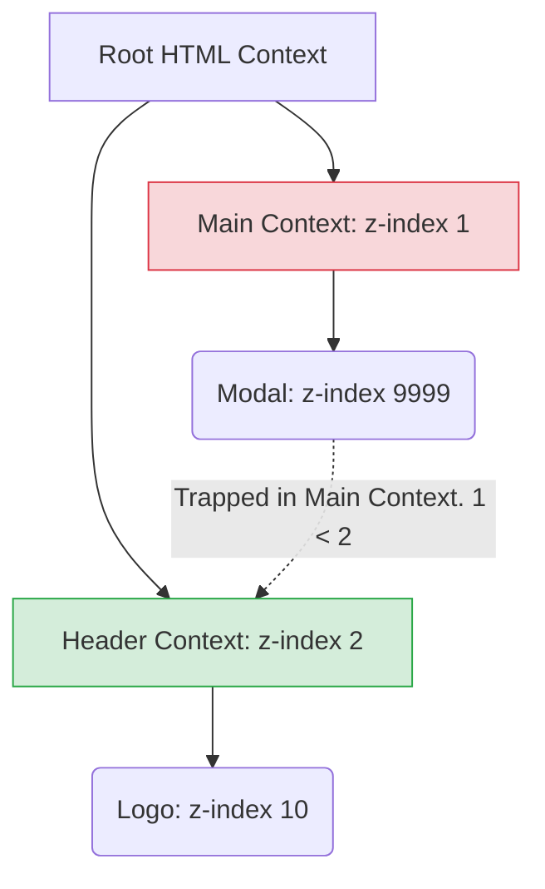

# Z-Index и Stacking Contexts (Контексты наложения)

## Суть концепции
`z-index` управляет порядком отрисовки элементов по оси Z (ближе/дальше от пользователя). Но самая важная часть, которую часто не понимают — это **Контекст наложения (Stacking Context)**. 
`z-index` работает не глобально для всей страницы, а **только внутри своего родительского контекста наложения**. Если элемент создал свой контекст наложения, все его дочерние элементы "заперты" внутри него по оси Z.

## Какую боль мы решаем
Классическая ситуация: разработчик делает модальное окно, ставит ему `z-index: 9999`, но оно всё равно перекрывается шапкой сайта, у которой `z-index: 2`. Разработчик в панике пишет `z-index: 999999999`, но ничего не меняется. Это происходит потому, что модалка заперта внутри `main`, который создал свой контекст наложения и проиграл шапке.

## Как это работает


Даже если у Модалки z-index 9999, она сравнивается с Хедером на уровне своих родителей: `Main (1) vs Header (2)`. Модалка проигрывает.

## Примеры кода

**❌ Антипаттерн: Бесконечное увеличение z-index**
```css
header { position: relative; z-index: 2; }
main { position: relative; z-index: 1; }

.modal {
  position: fixed;
  /* БЕСПОЛЕЗНО! Модалка внутри main никогда не перекроет header */
  z-index: 999999999; 
}
```

**✅ Правильное решение: Вынос из контекста (Portals)**
```html
<body>
  <header>...</header>
  <main>
    <!-- Контент -->
  </main>
  
  <!-- Модалка рендерится в корне body (например, через React Portals),
       создавая новый независимый контекст на одном уровне с header и main -->
  <div class="modal" style="position: fixed; z-index: 100;">...</div>
</body>
```

## Неочевидные нюансы и границы применимости
- **Скрытые триггеры контекста:** Контекст наложения создается не только комбинацией `position: relative + z-index`. Его незаметно создают свойства: `opacity` (меньше 1), `transform`, `filter`, `will-change`, `container-type` и `clip-path`. Вы можете добавить `transform: scale(1)` для анимации контейнера, и внезапно все модалки внутри него сломаются, так как создался новый Stacking Context!
- **Изоляция z-index:** Иногда создание контекста полезно. Свойство `isolation: isolate;` специально заставляет элемент создать новый контекст наложения без влияния на другие стили. Это удобно, чтобы дочерние элементы (с отрицательным `z-index: -1`) не "проваливались" под фон всей страницы, а прятались только под фон родителя.
