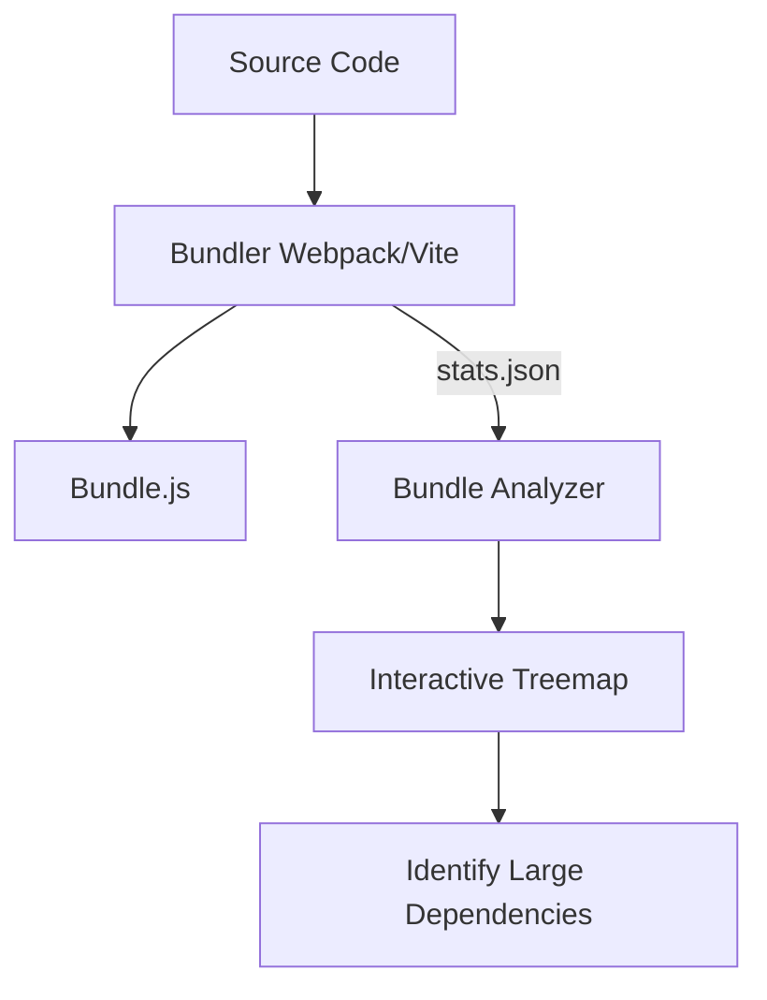

# Bundle Analysis
Анализ бандла (Bundle Analysis) — это процесс инспекции финального скомпилированного кода вашего приложения. Боль — "жирный" JavaScript, который долго скачивается и еще дольше парсится. Как правило, проблема начинается незаметно: кто-то импортировал `lodash` целиком вместо конкретной функции, и бандл вырос на 70 КБ. Анализатор показывает, из чего состоит бандл, визуализируя дерево зависимостей, чтобы вы могли найти "слонов" в вашей кодовой базе. На практике это работает через плагины (например, `webpack-bundle-analyzer` или `rollup-plugin-visualizer`), которые генерируют интерактивную карту (treemap). Трейдоффы: анализ добавляет время к CI/CD пайплайну, но позволяет поймать регрессии производительности до деплоя. Ломается подход, если вы не ставите лимиты на размер бандла — просто смотреть на красивую карту бесполезно без action items.



```javascript
// Антипаттерн: импорт всей библиотеки (увеличивает бандл)
import _ from 'lodash';
const arr = _.compact([0, 1, false, 2, '', 3]);

// Правильное решение: точечный импорт или использование ES модулей
import compact from 'lodash/compact';
// или
import { compact } from 'lodash-es';
```
