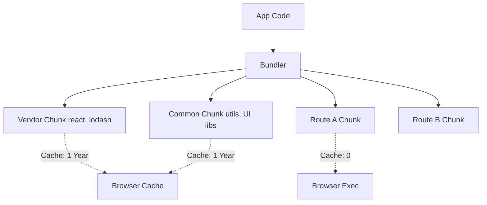

# Chunking Strategy
Стратегия разделения кода (Chunking Strategy) — это искусство нарезки монолитного `bundle.js` на оптимальные куски (чанки). Если грузить один большой файл, пользователь ждет, пока он весь скачается. Если грузить тысячу мелких — упираемся в оверхед HTTP-запросов и парсинга. Идеальная стратегия решает боль инвалидации кэша: если вы изменили одну строчку бизнес-логики, пользователь не должен перекачивать заново React, ReactDOM и прочие вендорные либы. Практика: код делится на вендорный (редко меняется), общий (используется на нескольких страницах) и специфичный для маршрута (подгружается динамически). Трейдоффы: слишком много чанков приводят к задержкам из-за сетевого оверхеда, а слишком мало — к неэффективному кэшированию.



```javascript
// Vite / Rollup Chunking Configuration (Правильное решение)
export default defineConfig({
  build: {
    rollupOptions: {
      output: {
        manualChunks(id) {
          if (id.includes('node_modules')) {
            // Выделяем вендорные либы в отдельный чанк, так как они редко обновляются
            return 'vendor';
          }
        }
      }
    }
  }
});
```
