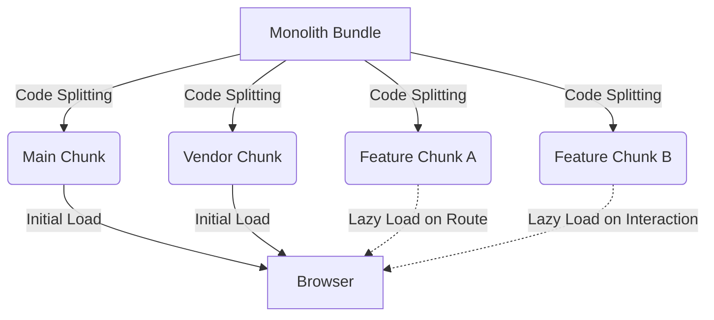

# Code Splitting

## Суть концепции
В эпоху Single Page Applications (SPA) мы часто сталкиваемся с проблемой: все наше приложение собирается в один гигантский `bundle.js`. Пользователь, заходя на главную страницу, вынужден скачивать код страницы профиля, настроек, админки и еще десятка экранов, которые ему, возможно, никогда не понадобятся. Это приводит к долгому времени первой загрузки (TTFB, FCP, LCP) и заморозке главного потока браузера (Long Tasks).

**Code Splitting (разделение кода)** — это инженерный подход, при котором монолитный бандл приложения дробится на более мелкие, независимые чанки (chunks). Эти чанки загружаются "по требованию" (on-demand) или параллельно. Мы решаем боль доставки лишнего JavaScript: пользователь скачивает только то, что необходимо для текущего экрана.

## Как это работает



Code Splitting обычно реализуется на двух уровнях:
1. **На уровне вендоров (Vendor Splitting):** Отделение библиотек (React, Lodash) от бизнес-логики. Вендорный код меняется редко и хорошо кэшируется.
2. **На уровне роутов/компонентов (Route-based / Component-based Splitting):** Динамический импорт экранов и тяжелых виджетов через `import()`.

## Примеры кода

### ❌ Антипаттерн: Все в одном бандле
```javascript
// App.jsx
import Dashboard from './Dashboard';
import Settings from './Settings';

function App({ route }) {
  // Код Settings будет загружен, даже если мы на Dashboard
  return route === 'dashboard' ? <Dashboard /> : <Settings />;
}
```

### ✅ Как надо: Разделение по роутам
```javascript
// App.jsx
import { Suspense, lazy } from 'react';

// Бандлер (Webpack/Vite) автоматически выделит эти компоненты в отдельные файлы
const Dashboard = lazy(() => import('./Dashboard'));
const Settings = lazy(() => import('./Settings'));

function App({ route }) {
  return (
    <Suspense fallback={<Spinner />}>
      {route === 'dashboard' ? <Dashboard /> : <Settings />}
    </Suspense>
  );
}
```

## Трейдоффы и границы применимости

- **Overhead на сеть:** Если раздробить приложение на слишком маленькие чанки (по 1-2 КБ), браузер потратит больше времени на установку HTTP-соединений, чем на скачивание (даже с HTTP/2). Нужно искать баланс (обычно чанки по 50-200 КБ).
- **Водопады загрузки (Waterfalls):** Динамический импорт внутри динамического импорта может создать цепочку последовательных запросов, замедляя рендеринг.
- **Где не нужно:** На критическом пути рендеринга (Critical Rendering Path). Если код необходим для первоначальной отрисовки Above-the-fold контента, не выносите его в ленивый чанк, иначе вы ухудшите метрику LCP (Largest Contentful Paint).
