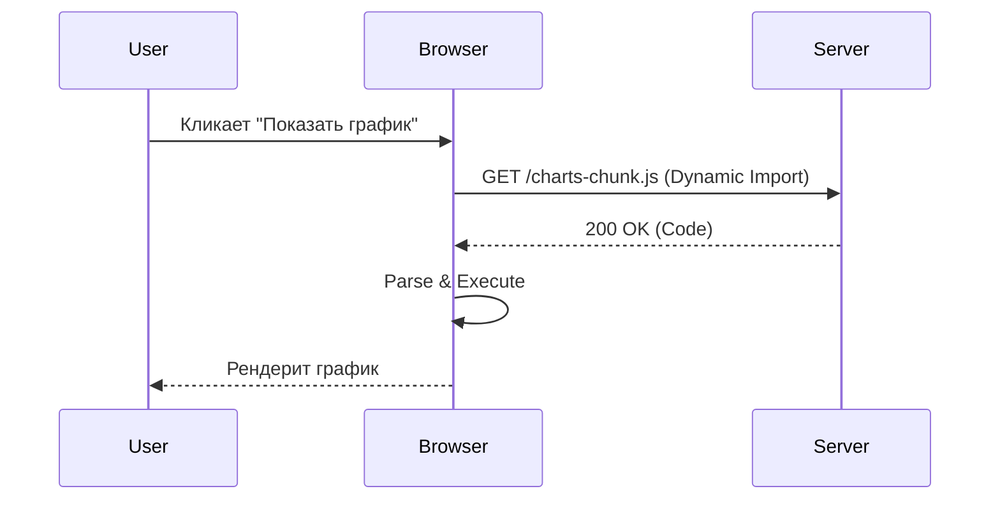

# Dynamic Imports
Динамические импорты (`import()`) позволяют загружать JavaScript-модули асинхронно, прямо во время выполнения (runtime), а не на этапе инициализации приложения. Боль: пользователь открывает главную страницу, а мы заставляем его качать код для модального окна настроек, тяжелой библиотеки графиков и админки, которые ему, возможно, никогда не понадобятся. Динамический импорт "отрывает" кусок кода от основного бандла, превращая его в отдельный чанк. Работает это просто: браузер делает сетевой запрос за скриптом только тогда, когда интерпретатор доходит до `import()`. Трейдоффы: появляется задержка (latency) в момент, когда фича понадобилась. Если пользователь кликает на кнопку открытия модалки, он увидит спиннер или задержку, пока код грузится. Поэтому тяжелые компоненты лучше префетчить.



```javascript
// Антипаттерн: статический импорт тяжелой либы, которая нужна не сразу
import { renderChart } from 'heavy-chart-lib';
button.addEventListener('click', () => renderChart());

// Правильное решение: динамический импорт
button.addEventListener('click', async () => {
    // Код загрузится ТОЛЬКО по клику
    const { renderChart } = await import('heavy-chart-lib');
    renderChart();
});
```
