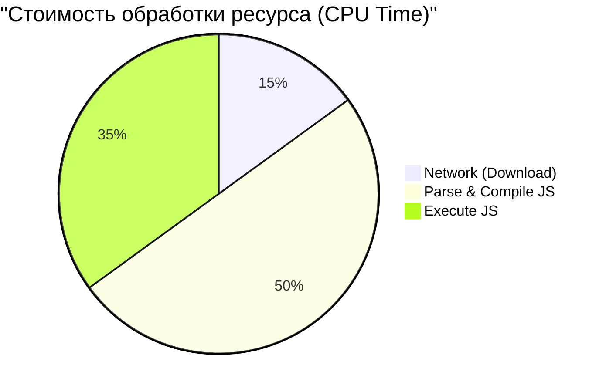

# JavaScript Cost
Стоимость JavaScript (The Cost of JavaScript) — это концепция, подчеркивающая, что JS является самым "дорогим" ресурсом в вебе. В отличие от картинок, которые нужно только скачать и отрендерить, JavaScript нужно скачать, распаковать, распарсить, скомпилировать (JIT) и выполнить. 100 КБ картинки и 100 КБ JS — это совершенно разные вещи по влиянию на CPU мобильного устройства. Боль: на мощном MacBook Pro разработчика приложение "летает", а на бюджетном Android-смартфоне пользователя интерфейс зависает на несколько секунд (Long Tasks). Практика: следить за бюджетами, использовать Server-Side Rendering (SSR) или Static Site Generation (SSG) для отдачи готового HTML, минимизировать гидратацию (например, архитектура Islands). Трейдофф: перенос логики на сервер усложняет инфраструктуру, а частичная гидратация требует специфичных фреймворков.



```html
<!-- Антипаттерн: Пустой div и мегабайт JS, который должен всё отрендерить (CSR) -->
<body>
  <div id="root"></div>
  <script src="app-bundle-1.5mb.js"></script>
</body>

<!-- Правильное решение: Предварительно отрендеренный HTML и минимальный JS (Hydration/Islands) -->
<body>
  <div id="root">
    <h1>Hello, World!</h1>
    <p>Static content here...</p>
    <interactive-widget data-island="true"></interactive-widget>
  </div>
  <script type="module" src="widget-hydrate-20kb.js"></script>
</body>
```
