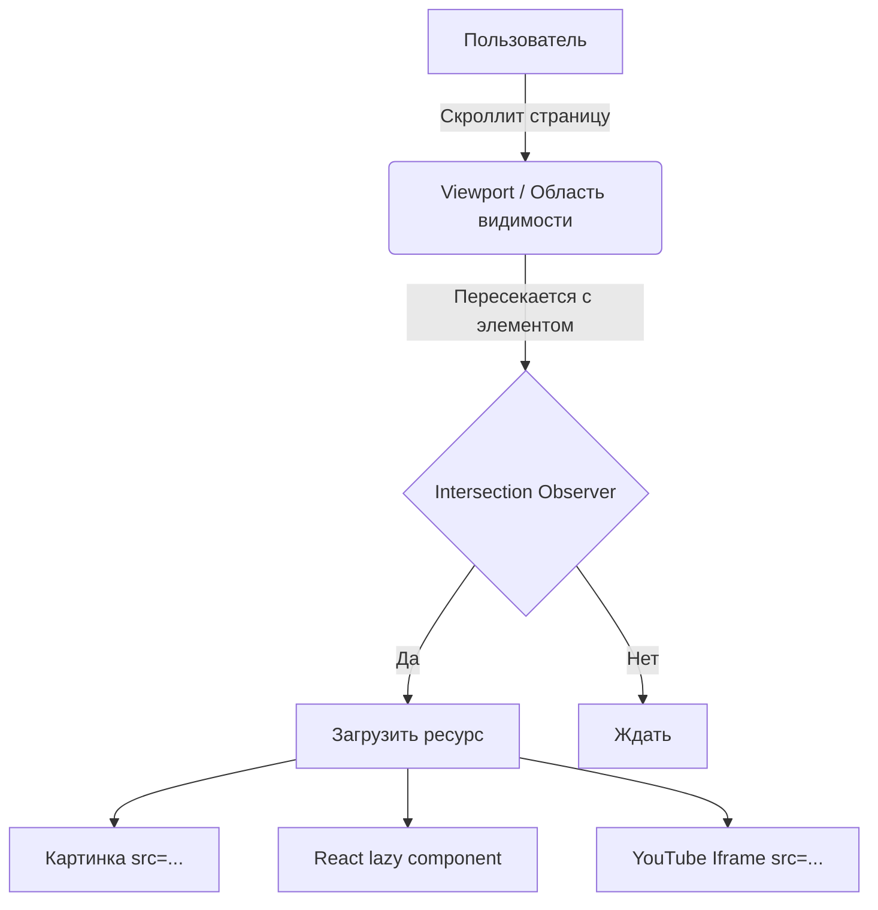

# Lazy Loading (Ленивая загрузка)

## Суть концепции
Пользователь открывает статью или карточку товара, просматривает первый экран, а где-то внизу страницы (в подвале) находится десяток тяжелых картинок, iframe с YouTube-видео или сложный виджет комментариев. По умолчанию браузер начинает скачивать все эти ресурсы немедленно. Это забивает сеть, съедает трафик (особенно на мобильных) и тормозит рендеринг того контента, который пользователь реально видит прямо сейчас.

**Lazy Loading** — это архитектурный паттерн отложенной загрузки некритичных ресурсов (изображений, скриптов, компонентов) до того момента, когда они понадобятся пользователю (например, при скролле к ним).

## Как это работает



Исторически это делали через события `scroll` в JavaScript, высчитывая `getBoundingClientRect()`, что вызывало Layout Thrashing и тормозило страницу. Сегодня для этого есть нативные API браузера и стандарты:
1. Атрибут `loading="lazy"` для тегов `` и `<iframe>`.
2. `IntersectionObserver` в JavaScript для сложной логики и загрузки компонентов.

## Примеры кода

### ❌ Антипаттерн: Загрузка всего и сразу
```html
<!-- Изображение будет скачано, даже если оно находится в самом низу страницы -->


<!-- Iframe тоже начнет грузить кучу JS с серверов Google -->
<iframe src="https://youtube.com/embed/XXXXX"></iframe>
```

### ✅ Как надо: Нативный Lazy Loading
```html
<!-- Браузер сам решит, когда начать загрузку, опираясь на близость к viewport -->


<iframe src="https://youtube.com/embed/XXXXX" loading="lazy"></iframe>
```

*Важно: Всегда указывайте `width` и `height` для ленивых картинок, чтобы избежать скачков контента (CLS) при их появлении!*

### ✅ Как надо: Ленивая загрузка React-компонентов при скролле
```javascript
import React, { Suspense } from 'react';
import { useInView } from 'react-intersection-observer';

// Ленивый импорт тяжелого компонента (например, 3D сцены)
const HeavyWidget = React.lazy(() => import('./HeavyWidget'));

function Page() {
  const { ref, inView } = useInView({
    triggerOnce: true, // Загрузить только один раз
    rootMargin: '200px 0px', // Начать загрузку за 200px до того, как элемент появится на экране
  });

  return (
    <div>
      <Header />
      <Content />
      {/* Контейнер-триггер */}
      <div ref={ref}>
        {inView && (
          <Suspense fallback={<Spinner />}>
            <HeavyWidget />
          </Suspense>
        )}
      </div>
    </div>
  );
}
```

## Трейдоффы и границы применимости

- **Антипаттерн первого экрана:** НИКОГДА не используйте `loading="lazy"` для картинок, которые находятся на первом экране (Above-the-fold) и являются LCP (Largest Contentful Paint) элементом. Это приведет к искусственной задержке отрисовки и просадке метрик, так как браузер будет ждать парсинга DOM и вычисления Layout, чтобы понять, нужна картинка сейчас или потом.
- **Мертвые зоны (rootMargin):** Загружать элемент точно в момент его появления на экране — плохая идея. Пользователь увидит "моргание" или пустой блок. Всегда настраивайте буфер (margin) в 300-500px, чтобы загрузка начиналась заранее.
- **Где применимо:** Идеально для длинных лент новостей (Infinite Scroll), подвалов, виджетов комментариев (Disqus), скрытых вкладок и модальных окон, которые открываются по клику.
