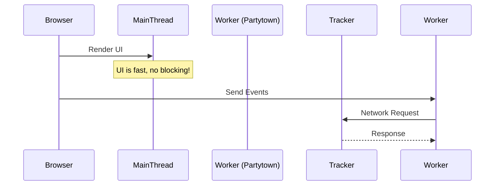

# Third Party Scripts
Сторонние скрипты (Third Party Scripts) — это аналитика, чаты поддержки, рекламные пиксели и виджеты социальных сетей, которые интегрируются в ваше приложение. Боль: маркетологи требуют добавить 10 трекеров, а разработка видит, как время до интерактивности (TTI) улетает в космос из-за блокирующих основной поток (Main Thread) скриптов, которые к тому же грузятся с медленных чужих серверов. Практика: откладывать загрузку (deferred/async) некритичных скриптов до тех пор, пока не произойдет первый скролл или взаимодействие (on-demand loading). Также помогает перенос тяжелых скриптов в Web Worker с помощью библиотек вроде Partytown. Трейдоффы: отложенная загрузка аналитики может привести к потере части данных о пользователях, которые быстро закрыли страницу. Использование Partytown добавляет сложности в конфигурацию и не все скрипты поддерживают выполнение вне DOM.



```html
<!-- Антипаттерн: Блокирующий сторонний скрипт в head -->
<head>
  <script src="https://slow-tracker.com/analytics.js"></script>
</head>

<!-- Правильное решение: Отложенная загрузка скрипта по событию или через async/defer -->
<script>
  window.addEventListener('scroll', () => {
    const script = document.createElement('script');
    script.src = "https://tracker.com/analytics.js";
    script.defer = true;
    document.body.appendChild(script);
  }, { once: true });
</script>
```
