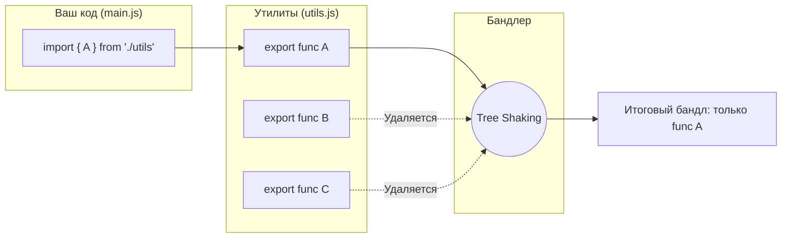

# Tree Shaking

## Суть концепции
Представьте, что вы покупаете целый швейцарский нож только ради того, чтобы воспользоваться зубочисткой. В мире JavaScript это происходит постоянно: вы импортируете огромную библиотеку утилит (например, `lodash`), используете из нее одну функцию, но в итоговый бандл попадает вся библиотека целиком.

**Tree Shaking** (буквально "тряска дерева") — это процесс удаления мертвого, неиспользуемого кода (dead code elimination) на этапе сборки приложения. Бандлер "трясет" синтаксическое дерево вашего кода (AST) и выкидывает листья (модули и функции), к которым нет путей выполнения. 

Это решает проблему раздувания размера бандла из-за сторонних зависимостей и общих утилит проекта.

## Как это работает

Tree Shaking опирается на статическую структуру модулей ES6 (`import` / `export`). Поскольку ES-модули статичны (их нельзя импортировать условно в `if`, как `require` в CommonJS), бандлер (Webpack, Rollup, esbuild) может на этапе компиляции точно определить, что используется, а что — нет.



## Примеры кода

### ❌ Антипаттерн: CommonJS и импорт всего объекта
```javascript
// Импорт всей библиотеки, бандлер не может понять, что именно используется
import _ from 'lodash'; 
const first = _.head([1, 2, 3]);

// Или CommonJS (не поддерживает статический анализ)
const utils = require('./utils');
utils.doSomething();
```

### ✅ Как надо: ES-модули и именованные импорты
```javascript
// Импортируем только конкретную функцию (из ES-версии библиотеки)
import { head } from 'lodash-es'; 
const first = head([1, 2, 3]);

// Свои утилиты:
import { doSomething } from './utils';
doSomething();
```

## Трейдоффы и границы применимости

- **Side Effects (Побочные эффекты):** Это главный враг Tree Shaking. Если модуль при импорте делает что-то помимо экспорта (например, мутирует глобальный объект `window`, добавляет полифиллы), бандлер побоится его удалять, даже если вы не используете его экспорты. 
  - *Решение:* Используйте поле `"sideEffects": false` в `package.json` вашей библиотеки, чтобы гарантировать бандлерам безопасность удаления.
- **Где ломается:** Tree Shaking не работает с динамическими импортами (`require()`, `import()`), с классами (методы класса сложно статически проанализировать на использование), и если вы транспилируете код в CommonJS слишком рано (например, через Babel до того, как Webpack обработает ES-модули).
