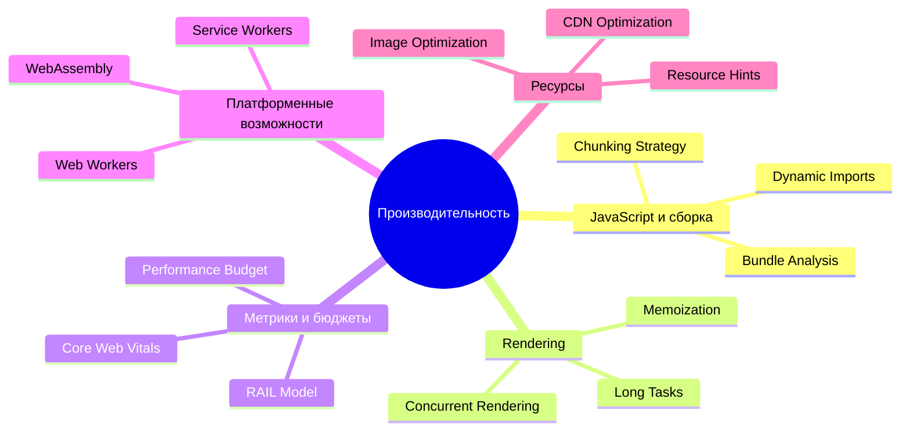

# 12 Производительность
Производительность (Performance) — это не просто метрика в Lighthouse, это ключевой фактор пользовательского опыта (UX) и бизнес-показателей (конверсия, удержание). В этом разделе собраны архитектурные паттерны и практики, которые помогают веб-приложениям работать быстро даже на слабых устройствах и медленных сетях. Боль: современные фреймворки и инструменты позволяют легко создавать сложный UI, но цена этого — огромные JS-бандлы, водопады запросов и блокировка основного потока. Практика: производительность должна закладываться на этапе проектирования архитектуры, а не "оптимизироваться потом". Это включает стратегию бандлинга, конкурентный рендеринг, перенос тяжелых задач в воркеры и грамотное использование кэширования на всех уровнях.

