# Concurrent Rendering
Конкурентный рендеринг (Concurrent Rendering) — это способность UI-фреймворка (в первую очередь React 18+) прерывать процесс отрисовки, чтобы ответить на более приоритетные задачи, например, пользовательский ввод. Боль: традиционный рендеринг работает синхронно — если мы рендерим огромную таблицу на 10 000 строк, браузер "зависнет" и не позволит пользователю даже напечатать символ в инпуте поиска, пока таблица не отрисуется целиком (Long Task). Конкурентность решает это, разбивая рендеринг на мелкие чанки. Фреймворк выполняет часть работы, проверяет, нет ли важных событий (нажатий клавиш), и если есть, прерывается, обрабатывает ввод, а затем продолжает рендеринг в фоновом режиме. Трейдоффы: состояние приложения может стать неконсистентным (tearing), если мутировать внешние переменные во время рендера. Требуется строгая чистота функций рендера.

```mermaid
gantt
    title Synchronous vs Concurrent Rendering
    dateFormat  s
    axisFormat %S
    section Synchronous
    Render huge table       :done, a1, 0, 4s
    User types "A" (Blocked):crit, 1, 1s
    section Concurrent
    Render chunk 1          :done, b1, 0, 1s
    User types "A" (Handled):crit, 1, 1s
    Render chunk 2          :done, b2, 2, 1s
    Render chunk 3          :done, b3, 3, 1s
```



```javascript
import { useState, useTransition } from 'react';

// Антипаттерн: Обычный стейт для тяжелой операции блокирует UI
// const [filter, setFilter] = useState('');
// <input onChange={(e) => setFilter(e.target.value)} />

// Правильное решение: useTransition в React 18
export function FilteredList() {
  const [filter, setFilter] = useState('');
  const [isPending, startTransition] = useTransition();

  const handleChange = (e) => {
    // Ввод пользователя обрабатывается мгновенно (High Priority)
    // Рендеринг тяжелого списка откладывается (Low Priority)
    startTransition(() => {
      setFilter(e.target.value);
    });
  };

  return (
    <>
      <input type="text" onChange={handleChange} />
      {isPending ? <Spinner /> : <HeavyList filter={filter} />}
    </>
  );
}
```
