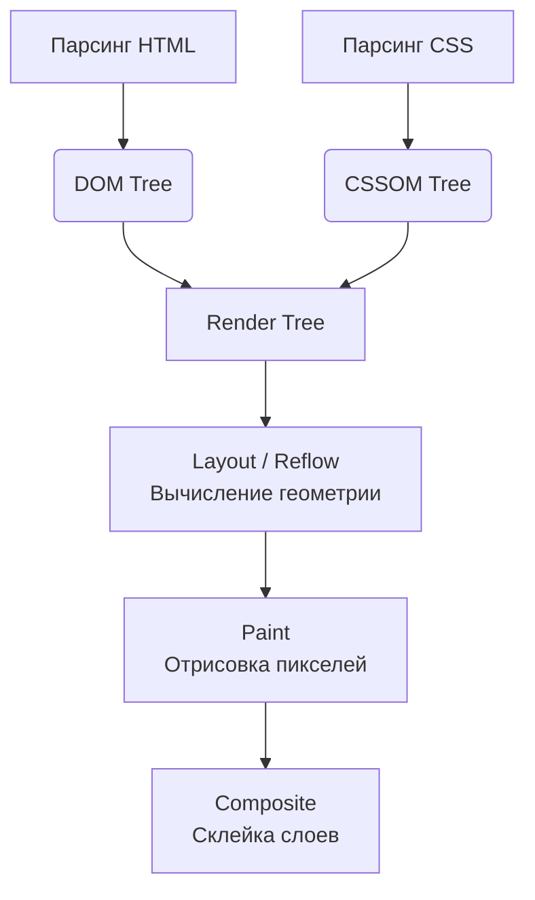

# Critical Rendering Path (Критический путь рендеринга)

## Суть концепции
Когда браузер получает HTML-документ от сервера, он не может мгновенно нарисовать страницу. Ему нужно скачать ресурсы, распарсить их, построить структуру документа, наложить стили, вычислить геометрию и, наконец, закрасить пиксели. Эта последовательность шагов от получения HTML до появления первых пикселей на экране называется **Критическим путем рендеринга (Critical Rendering Path, CRP)**.

Наша боль: если на этом пути есть блокирующие элементы (огромные CSS-файлы в `<head>`, синхронные скрипты, долгие запросы к API), пользователь будет смотреть на пустой белый экран. Оптимизация CRP направлена на то, чтобы браузер как можно быстрее показал значимый контент (улучшение метрики First Contentful Paint / Largest Contentful Paint).

## Как это работает

Процесс рендеринга состоит из следующих этапов:



**Блокирующие ресурсы (Render-blocking resources):**
- **CSS:** По умолчанию CSS блокирует рендеринг. Браузер не нарисует ничего, пока не скачает и не распарсит весь CSS.
- **Синхронный JavaScript:** Тег `<script src="...">` без атрибутов `defer` или `async` блокирует парсинг HTML. Браузер останавливается, скачивает скрипт, выполняет его и только потом продолжает строить DOM.

## Примеры кода

### ❌ Антипаттерн: Блокировка рендеринга
```html
<head>
  <!-- Огромный CSS блокирует рендеринг -->
  <link rel="stylesheet" href="/huge-styles.css">
  
  <!-- Синхронный скрипт останавливает парсинг HTML -->
  <script src="/analytics.js"></script>
  <script src="/heavy-framework.js"></script>
</head>
<body>
  <!-- Пользователь не увидит этот текст, пока не загрузятся стили и скрипты -->
  <h1>Привет, мир!</h1>
</body>
```

### ✅ Как надо: Оптимизированный CRP
```html
<head>
  <!-- 1. Инлайним критический CSS (Critical CSS) прямо в HTML -->
  <style>
    body { margin: 0; font-family: sans-serif; }
    h1 { color: #333; }
  </style>

  <!-- 2. Асинхронно загружаем некритический CSS -->
  <link rel="stylesheet" href="/huge-styles.css" media="print" onload="this.media='all'">
  
  <!-- 3. Скрипты загружаем с defer (выполнятся после парсинга HTML, но до DOMContentLoaded) -->
  <script defer src="/heavy-framework.js"></script>
  <script async src="/analytics.js"></script> <!-- async для независимых скриптов -->
</head>
<body>
  <h1>Привет, мир!</h1>
</body>
```

## Трейдоффы и границы применимости

- **Critical CSS (Инлайн стилей):** Извлечение только необходимых стилей для первого экрана и вставка их в `<head>` значительно ускоряет FCP. Однако это ломает кэширование (CSS теперь часть HTML) и раздувает размер самого HTML-документа. Если HTML станет больше 14 КБ, он не поместится в первое окно TCP-передачи (TCP Initial Window), что замедлит загрузку.
- **Где не применимо (или сложно):** В классических SPA (Create React App), где весь HTML — это пустой `div`, а вся структура строится JS. Там критический путь рендеринга полностью зависит от загрузки и выполнения `bundle.js`. В таком случае лучше использовать Server-Side Rendering (Next.js/Nuxt) или Static Site Generation, чтобы изначально отдавать заполненный HTML.
