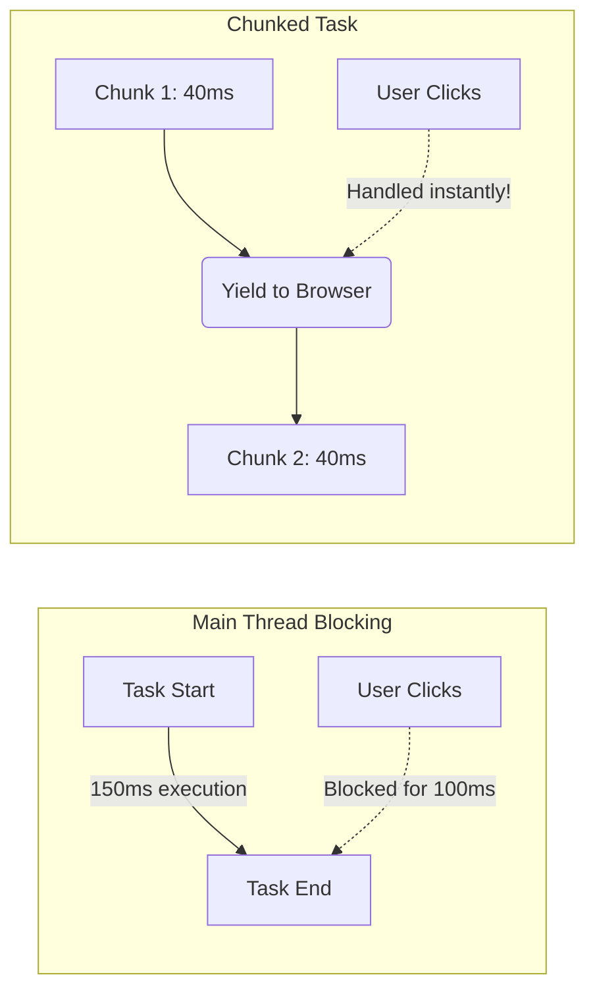

# Long Tasks
Долгие задачи (Long Tasks) — это любые фрагменты JavaScript-кода, выполнение которых занимает более 50 миллисекунд в основном потоке (Main Thread) браузера. Боль: браузер однопоточный, и пока выполняется тяжелый цикл обхода массива на 100 тысяч элементов, он не может ни перерисовать экран, ни ответить на клики пользователя. Интерфейс выглядит зависшим. 50 мс — это предел, за которым человеческий глаз начинает замечать задержку (по правилам RAIL). Практика: разбивать одну огромную задачу на множество маленьких (Chunking), используя `setTimeout`, `requestAnimationFrame` или новый API `scheduler.yield()`. В идеале — выносить тяжелые вычисления в Web Workers. Трейдоффы: разбиение задачи через `setTimeout` может увеличить общее время ее выполнения из-за оверхеда планировщика макротасок браузера.



```javascript
// Антипаттерн: Долгая задача, блокирующая поток на секунды
function processHugeArray(arr) {
  for (let i = 0; i < arr.length; i++) {
    complexMath(arr[i]); // Main Thread "зависает"
  }
}

// Правильное решение: Разбиение (Chunking) с помощью setTimeout
function processHugeArrayChunked(arr) {
  let i = 0;
  function processChunk() {
    const end = Math.min(i + 1000, arr.length);
    for (; i < end; i++) {
      complexMath(arr[i]);
    }
    if (i < arr.length) {
      // Отдаем управление браузеру, затем продолжаем
      setTimeout(processChunk, 0); 
    }
  }
  processChunk();
}
```
